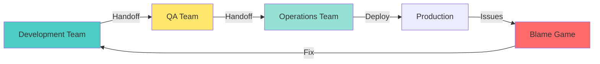
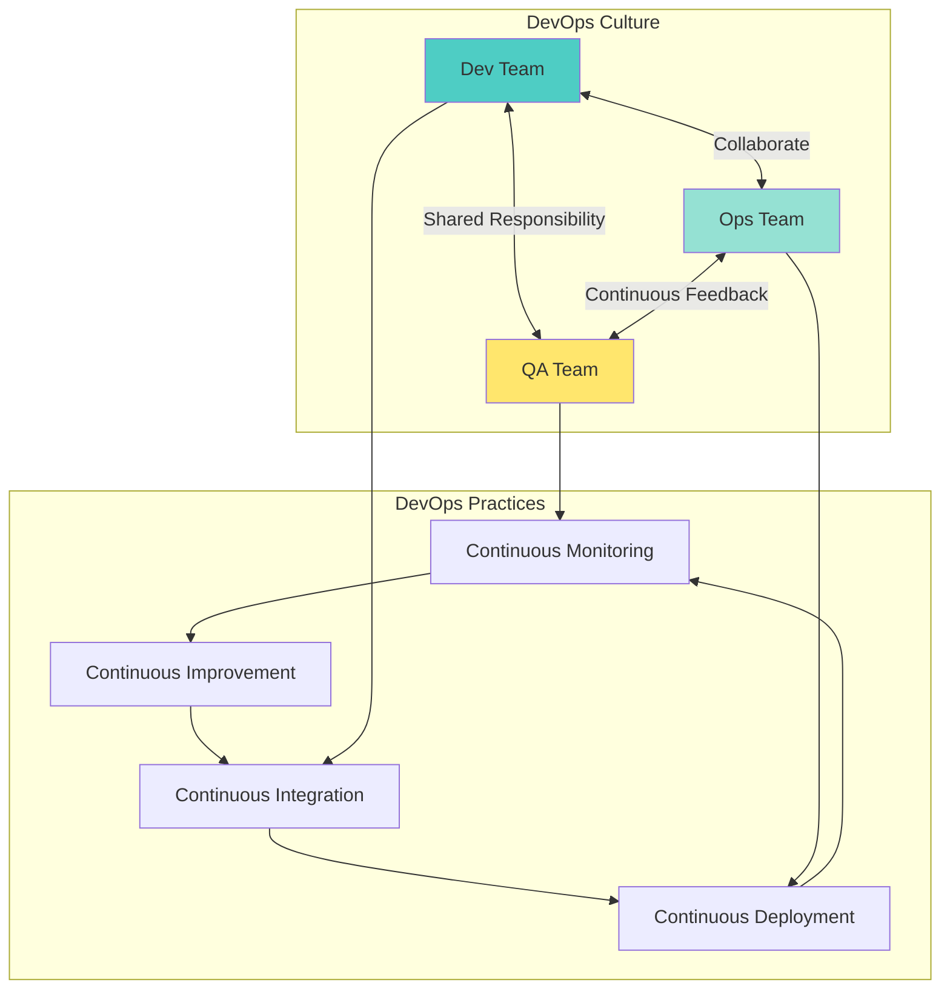
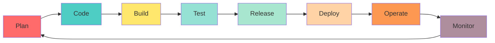
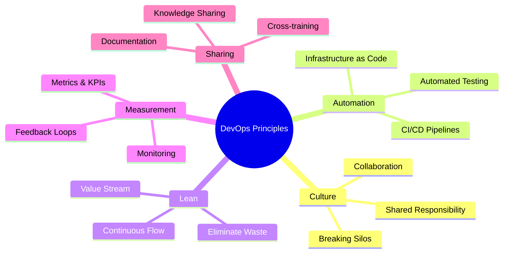
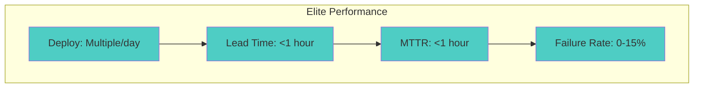
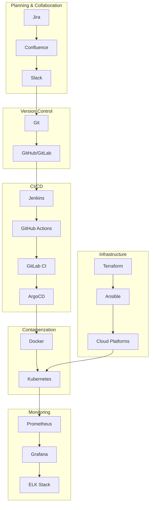
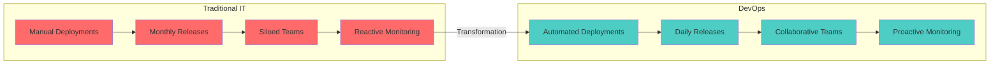

# 🚀 Introduction to DevOps

> "DevOps is not a goal, but a never-ending process of continual improvement." - Jez Humble

---

## 📖 What is DevOps?

**DevOps** is a cultural and technical movement that combines **Development** (Dev) and **Operations** (Ops) to improve collaboration, accelerate software delivery, and enhance system reliability through automation, monitoring, and continuous improvement.

### Core Definition

DevOps is:
- **Culture**: Collaboration between development and operations teams
- **Practices**: Automation, CI/CD, Infrastructure as Code, monitoring
- **Tools**: Docker, Kubernetes, Jenkins, Terraform, etc.
- **Philosophy**: Continuous improvement, fast feedback, automation

---

## 🎯 Why DevOps Exists

### The Problem: Traditional Waterfall Model

**Traditional Challenges:**
- Long release cycles (weeks/months)
- Manual deployments prone to errors
- Siloed teams with poor communication
- Slow feedback loops
- Difficult troubleshooting and rollbacks
- Inconsistent environments

### The Solution: DevOps Approach

**DevOps Benefits:**
- ✅ Faster time to market
- ✅ Reduced deployment failures
- ✅ Faster recovery from failures
- ✅ Improved collaboration
- ✅ Better quality software
- ✅ Automated processes

---

## 🔄 DevOps Lifecycle

The DevOps lifecycle represents the continuous loop of software development and operations:

### 1. **Plan**
- Define requirements
- Create roadmaps
- Plan sprints/iterations
- Tools: Jira, Confluence, GitHub Projects

### 2. **Code**
- Write application code
- Follow coding standards
- Code reviews
- Tools: Git, VS Code, IDE

### 3. **Build**
- Compile code
- Create artifacts
- Package applications
- Tools: Maven, Gradle, Docker

### 4. **Test**
- Unit tests
- Integration tests
- Performance tests
- Tools: JUnit, Selenium, TestNG

### 5. **Release**
- Version control
- Release management
- Change approval
- Tools: Git, Release management tools

### 6. **Deploy**
- Deploy to environments
- Infrastructure provisioning
- Configuration management
- Tools: Kubernetes, Ansible, Terraform

### 7. **Operate**
- Monitor applications
- Manage infrastructure
- Handle incidents
- Tools: Kubernetes, Cloud platforms

### 8. **Monitor**
- Collect metrics
- Analyze logs
- Set up alerts
- Tools: Prometheus, Grafana, ELK Stack

---

## 🏛️ DevOps Principles (CALMS)

### 1. **Culture**
- **Collaboration**: Dev and Ops work together
- **Shared Responsibility**: Everyone owns the entire lifecycle
- **Break Silos**: Remove organizational barriers
- **Blameless Culture**: Focus on learning from failures

### 2. **Automation**
- **CI/CD Pipelines**: Automated build, test, and deployment
- **Infrastructure as Code**: Automated infrastructure provisioning
- **Automated Testing**: Reduce manual testing efforts
- **Self-Service**: Enable developers to deploy independently

### 3. **Lean**
- **Eliminate Waste**: Remove unnecessary processes
- **Continuous Flow**: Streamline delivery pipeline
- **Value Stream Mapping**: Identify bottlenecks
- **Small Batch Sizes**: Frequent, small releases

### 4. **Measurement**
- **Metrics & KPIs**: Track deployment frequency, lead time, MTTR
- **Monitoring**: Real-time visibility into systems
- **Feedback Loops**: Fast feedback on changes
- **Data-Driven Decisions**: Make decisions based on data

### 5. **Sharing**
- **Knowledge Sharing**: Share learnings across teams
- **Documentation**: Maintain up-to-date documentation
- **Cross-Training**: Learn from each other
- **Open Communication**: Transparent communication channels

---

## 📊 DevOps Metrics (DORA Metrics)

The Four Key Metrics that measure DevOps performance:

### 1. **Deployment Frequency**
- How often an organization successfully releases to production
- **Elite**: Multiple times per day
- **High**: Once per day to once per week
- **Medium**: Once per month to once per 6 months
- **Low**: Less than once per 6 months

### 2. **Lead Time for Changes**
- The amount of time it takes to go from code commit to code successfully running in production
- **Elite**: Less than one hour
- **High**: One day to one week
- **Medium**: One month to six months
- **Low**: More than six months

### 3. **Mean Time to Recovery (MTTR)**
- How long it takes an organization to recover from a failure in production
- **Elite**: Less than one hour
- **High**: Less than one day
- **Medium**: Less than one day to one week
- **Low**: More than one week

### 4. **Change Failure Rate**
- The percentage of deployments causing a failure in production (e.g., hotfix or rollback)
- **Elite**: 0-15%
- **High**: 16-30%
- **Medium**: 16-30%
- **Low**: 31-45%

---

## 🛠️ DevOps Toolchain

A typical DevOps toolchain includes:

---

## 🎓 DevOps Roles & Responsibilities

### DevOps Engineer
- Build and maintain CI/CD pipelines
- Automate infrastructure provisioning
- Monitor and optimize systems
- Bridge development and operations

### Site Reliability Engineer (SRE)
- Ensure system reliability and availability
- Define and measure SLIs/SLOs/SLAs
- Focus on automation to reduce toil
- Incident response and post-mortems

### Platform Engineer
- Build and maintain internal developer platforms
- Provide self-service infrastructure
- Enable developer productivity
- Manage Kubernetes and cloud platforms

---

## 🚀 DevOps Journey: From Traditional to DevOps

---

## 🎯 DevOps Success Factors

### ✅ Key Success Factors

1. **Strong Leadership Support**
   - Executive sponsorship
   - Cultural transformation support
   - Investment in tools and training

2. **Incremental Adoption**
   - Start small, scale gradually
   - Quick wins to build momentum
   - Iterative improvement

3. **Tool Selection**
   - Choose tools that fit your needs
   - Standardize on a toolchain
   - Evaluate and adapt regularly

4. **Continuous Learning**
   - Regular training sessions
   - Knowledge sharing
   - Stay updated with trends

5. **Metrics-Driven**
   - Define success metrics
   - Measure regularly
   - Act on data insights

---

## 🔮 DevOps Future Trends

### Emerging Trends (2024-2025)

1. **GitOps**
   - Version-controlled deployments
   - Declarative configuration management
   - Automated sync and reconciliation

2. **AIOps**
   - AI/ML for operations
   - Anomaly detection
   - Predictive maintenance

3. **FinOps**
   - Cloud cost optimization
   - Cost visibility and accountability
   - Resource optimization

4. **Platform Engineering**
   - Internal developer platforms
   - Self-service infrastructure
   - Developer experience focus

5. **Security as Code**
   - Shift-left security
   - Security automation
   - DevSecOps integration

---

## 📚 Next Steps

Now that you understand the fundamentals of DevOps:

1. **Learn Git** → [01 Version Control](./../01-version-control/git-fundamentals.md)
2. **Master Linux** → [02 Linux Fundamentals](./../02-linux-fundamentals/linux-basics.md)
3. **Explore Docker** → [03 Containerization](./../03-containerization/docker/docker-fundamentals.md)
4. **Study Kubernetes** → [04 Container Orchestration](./../04-container-orchestration/kubernetes/kubernetes-fundamentals.md)

---

## 🎓 Key Takeaways

- ✅ DevOps is a **culture and set of practices**, not just tools
- ✅ It bridges **Development and Operations** teams
- ✅ **Automation** is a key enabler
- ✅ **Continuous improvement** is essential
- ✅ **Metrics** help measure success
- ✅ DevOps requires **cultural change**, not just technical changes

---

## 📖 Additional Resources

- **Books**: "The Phoenix Project", "The DevOps Handbook", "Accelerate"
- **Certifications**: AWS DevOps Engineer, Docker DCA, Kubernetes CKA/CKAD
- **Communities**: DevOps subreddit, DevOps Twitter, DevOps conferences

---

**Author**: Chinmaya Jena  
**Last Updated**: January 2025  
**Version**: 1.0

