# 🗺️ DevOps Learning Path: From Zero to Hero

> "The journey of a thousand miles begins with a single step." - Lao Tzu

This comprehensive learning path will guide you from a complete beginner to a DevOps expert, covering all essential tools, concepts, and best practices used in modern software development and operations.

---

## 🎯 Learning Path Overview

```mermaid
graph TD
    Start[🚀 Start Here] --> Stage0[Stage 0: Foundation<br/>0-4 weeks]
    Stage0 --> Stage1[Stage 1: Core Tools<br/>4-12 weeks]
    Stage1 --> Stage2[Stage 2: Orchestration<br/>12-20 weeks]
    Stage2 --> Stage3[Stage 3: Advanced<br/>20-28 weeks]
    Stage3 --> Stage4[Stage 4: Expert<br/>28+ weeks]
    
    Stage0 --> |Basics| Stage1
    Stage1 --> |Intermediate| Stage2
    Stage2 --> |Advanced| Stage3
    Stage3 --> |Expert| Stage4
    Stage4 --> Mastery[🎓 DevOps Mastery]
    
    style Start fill:#ff6b6b
    style Stage0 fill:#ffd93d
    style Stage1 fill:#6bcf7f
    style Stage2 fill:#4d96ff
    style Stage3 fill:#9d65c9
    style Stage4 fill:#f5a623
    style Mastery fill:#4ecdc4
```



---

## 🌱 Stage 0: Foundation (Weeks 0-4)

**Goal**: Understand DevOps culture and master fundamental prerequisites

### Week 1-2: Introduction & Concepts
- [x] Read [Introduction to DevOps](./introduction-to-devops.md)
- [x] Understand DevOps principles (CALMS)
- [x] Learn about DORA metrics
- [x] Study DevOps lifecycle
- **Time Commitment**: 10-15 hours/week

### Week 3-4: Version Control Mastery
- [ ] Complete [Git Fundamentals](../01-version-control/git-fundamentals.md)
- [ ] Practice Git commands daily
- [ ] Learn branching strategies
- [ ] Contribute to open source projects
- **Time Commitment**: 15-20 hours/week

---

## 📚 Stage 1: Core Tools (Weeks 4-12)

**Goal**: Master essential DevOps tools for daily operations

### Week 5-6: Linux Fundamentals
- [ ] Complete [Linux Basics](../02-linux-fundamentals/linux-basics.md)
- [ ] Practice shell scripting
- [ ] Learn system administration basics
- [ ] Set up a Linux VM and practice
- **Time Commitment**: 15-20 hours/week

### Week 7-9: Containerization with Docker
- [ ] Complete [Docker Fundamentals](../03-containerization/docker/docker-fundamentals.md)
- [ ] Learn Dockerfile best practices
- [ ] Practice with Docker Compose
- [ ] Build and push images to Docker Hub
- **Projects**: Containerize 2-3 applications
- **Time Commitment**: 20-25 hours/week

### Week 10-12: CI/CD Pipelines
- [ ] Complete [CI/CD Concepts](../05-ci-cd/cicd-concepts.md)
- [ ] Master [Jenkins](../05-ci-cd/jenkins/jenkins-complete-guide.md)
- [ ] Learn [GitHub Actions](../05-ci-cd/github-actions/github-actions-guide.md)
- [ ] Learn [GitLab CI](../05-ci-cd/gitlab-ci/gitlab-ci-guide.md)
- **Projects**: Create CI/CD pipelines for 2-3 projects
- **Time Commitment**: 20-25 hours/week

---

## 🏗️ Stage 2: Orchestration (Weeks 12-20)

**Goal**: Master container orchestration and infrastructure automation

### Week 13-16: Kubernetes Deep Dive
- [ ] Complete [Kubernetes Fundamentals](../04-container-orchestration/kubernetes/kubernetes-fundamentals.md)
- [ ] Learn advanced Kubernetes concepts
- [ ] Practice with minikube/kind
- [ ] Deploy applications to Kubernetes
- [ ] Learn Helm charts
- **Projects**: Deploy 3-tier application on Kubernetes
- **Time Commitment**: 25-30 hours/week

### Week 17-20: Infrastructure as Code
- [ ] Complete [Terraform Fundamentals](../06-infrastructure-as-code/terraform/terraform-fundamentals.md)
- [ ] Learn [Ansible Fundamentals](../06-infrastructure-as-code/ansible/ansible-fundamentals.md)
- [ ] Practice with cloud providers (AWS/Azure/GCP)
- [ ] Implement multi-environment IaC
- **Projects**: Provision infrastructure for a complete application stack
- **Time Commitment**: 25-30 hours/week

---

## 🚀 Stage 3: Advanced (Weeks 20-28)

**Goal**: Master monitoring, observability, and security

### Week 21-24: Monitoring & Observability
- [ ] Complete [Monitoring Concepts](../07-monitoring-logging/monitoring-concepts.md)
- [ ] Learn [Prometheus](../07-monitoring-logging/prometheus/prometheus-guide.md)
- [ ] Master [Grafana](../07-monitoring-logging/grafana/grafana-guide.md)
- [ ] Set up [ELK Stack](../07-monitoring-logging/elk-stack/elk-stack-guide.md)
- **Projects**: Implement full observability stack
- **Time Commitment**: 20-25 hours/week

### Week 25-28: DevSecOps
- [ ] Complete [DevSecOps Introduction](../08-devsecops/devsecops-introduction.md)
- [ ] Learn security scanning tools
- [ ] Implement secrets management
- [ ] Practice container security
- [ ] Integrate security into CI/CD pipelines
- **Projects**: Secure an application from development to production
- **Time Commitment**: 20-25 hours/week

---

## 🎓 Stage 4: Expert (Weeks 28+)

**Goal**: Achieve expert-level understanding and specialize

### Week 29-32: Cloud Platforms & Multi-Cloud
- [ ] Deep dive into [AWS DevOps](../09-cloud-platforms/aws/aws-devops.md)
- [ ] Learn [Azure DevOps](../09-cloud-platforms/azure/azure-devops.md)
- [ ] Explore [GCP DevOps](../09-cloud-platforms/gcp/gcp-devops.md)
- [ ] Understand multi-cloud strategies
- **Projects**: Deploy applications across multiple cloud providers
- **Time Commitment**: 25-30 hours/week

### Week 33+: Specialization & Best Practices
- [ ] Study [Enterprise Architecture Patterns](../10-best-practices/architecture-patterns.md)
- [ ] Learn [Production Best Practices](../10-best-practices/production-best-practices.md)
- [ ] Review [Case Studies](../10-best-practices/case-studies.md)
- [ ] Choose a specialization:
  - Platform Engineering
  - Site Reliability Engineering (SRE)
  - Cloud Architecture
  - Security Engineering
- **Time Commitment**: 20+ hours/week

---

## 📊 Learning Path Visualization


---

## 🎯 Milestones & Checkpoints

### Milestone 1: Foundation Complete (Week 4)
**Skills Acquired:**
- ✅ Understand DevOps culture and principles
- ✅ Master Git commands and workflows
- ✅ Comfortable with command line
- ✅ Basic understanding of software development lifecycle

**Validation:**
- Complete 10+ Git exercises
- Contribute to a GitHub repository
- Explain DevOps principles clearly

---

### Milestone 2: Core Tools Mastery (Week 12)
**Skills Acquired:**
- ✅ Linux system administration basics
- ✅ Docker containerization
- ✅ CI/CD pipeline creation
- ✅ Automated testing and deployment

**Validation:**
- Containerize 2-3 applications
- Create working CI/CD pipelines
- Deploy applications automatically

---

### Milestone 3: Orchestration Expert (Week 20)
**Skills Acquired:**
- ✅ Kubernetes cluster management
- ✅ Infrastructure as Code (Terraform, Ansible)
- ✅ Multi-environment deployments
- ✅ Application scaling and management

**Validation:**
- Deploy applications on Kubernetes
- Provision infrastructure with IaC
- Manage multi-environment setups

---

### Milestone 4: Advanced Practitioner (Week 28)
**Skills Acquired:**
- ✅ Full-stack observability
- ✅ Security integration in DevOps
- ✅ Incident response and troubleshooting
- ✅ Performance optimization

**Validation:**
- Implement complete monitoring stack
- Secure CI/CD pipelines
- Handle production incidents

---

### Milestone 5: DevOps Expert (Week 32+)
**Skills Acquired:**
- ✅ Multi-cloud expertise
- ✅ Enterprise architecture patterns
- ✅ Platform engineering
- ✅ Leadership and mentoring

**Validation:**
- Design enterprise DevOps architectures
- Lead DevOps transformations
- Mentor junior engineers

---

## 📚 Recommended Study Schedule

### Daily Routine (2-3 hours)
1. **Morning** (1 hour): Read documentation and concepts
2. **Afternoon** (1 hour): Hands-on practice and labs
3. **Evening** (30 min): Review and note-taking

### Weekly Routine
- **Monday**: New concepts and theory
- **Tuesday-Thursday**: Hands-on practice
- **Friday**: Project work
- **Saturday**: Review and practice exams
- **Sunday**: Rest and reflection

---

## 🛠️ Practice Projects by Stage

### Stage 0-1 Projects
1. **Personal Website CI/CD**
   - Simple HTML/CSS website
   - Git repository management
   - Basic CI/CD pipeline

2. **Dockerized Application**
   - Containerize a Python/Node.js app
   - Multi-stage Dockerfile
   - Docker Compose setup

### Stage 2 Projects
3. **Kubernetes Microservices**
   - Deploy 3-tier application
   - Use Helm charts
   - Implement service mesh

4. **Infrastructure Automation**
   - Terraform for cloud infrastructure
   - Ansible for configuration
   - Multi-environment setup

### Stage 3-4 Projects
5. **Complete DevOps Pipeline**
   - CI/CD with security scanning
   - Kubernetes deployment
   - Full observability stack
   - Multi-cloud deployment

---

## 🏆 Certifications Roadmap

### Beginner Certifications (Stage 1-2)
- **Git**: GitHub Certifications
- **Docker**: Docker Certified Associate (DCA)
- **Linux**: Linux Foundation Certifications

### Intermediate Certifications (Stage 2-3)
- **Kubernetes**: Certified Kubernetes Administrator (CKA)
- **Kubernetes**: Certified Kubernetes Application Developer (CKAD)
- **Terraform**: HashiCorp Certified: Terraform Associate

### Advanced Certifications (Stage 3-4)
- **AWS**: AWS Certified DevOps Engineer - Professional
- **Azure**: Microsoft Azure DevOps Engineer Expert
- **GCP**: Google Cloud Professional DevOps Engineer

---

## 📈 Progress Tracking

### Weekly Checklist Template

```markdown
## Week [X] Progress

### Theory
- [ ] Read documentation: [topic]
- [ ] Watched tutorials: [links]
- [ ] Completed exercises: [count]

### Practice
- [ ] Hands-on labs: [count]
- [ ] Projects worked on: [list]
- [ ] Commits made: [count]

### Challenges
- [ ] Issues faced: [list]
- [ ] Solutions found: [list]
- [ ] Help needed: [areas]

### Next Week Goals
- [ ] Goal 1
- [ ] Goal 2
- [ ] Goal 3
```

---

## 🎓 Learning Resources by Topic

### Version Control
- Official Git documentation
- Atlassian Git tutorials
- GitHub Learning Lab

### Docker
- Docker official documentation
- Docker Deep Dive (book)
- Docker courses on Udemy/Pluralsight

### Kubernetes
- Kubernetes.io documentation
- Kubernetes the Hard Way
- KodeKloud courses

### CI/CD
- Jenkins documentation
- GitHub Actions documentation
- GitLab CI/CD documentation

### Infrastructure as Code
- Terraform documentation
- Ansible documentation
- HashiCorp Learn

---

## ⚠️ Common Pitfalls to Avoid

1. **Skipping Fundamentals**
   - ❌ Don't skip Linux basics
   - ❌ Don't rush through Git
   - ✅ Build strong foundations

2. **Theory Without Practice**
   - ❌ Just reading documentation
   - ✅ Practice hands-on regularly

3. **Tool Hopping**
   - ❌ Learning too many tools superficially
   - ✅ Master one tool deeply, then learn similar ones

4. **Ignoring Best Practices**
   - ❌ Working examples without understanding why
   - ✅ Understand principles and best practices

5. **Not Building Projects**
   - ❌ Only following tutorials
   - ✅ Build your own projects

---

## 🎯 Success Metrics

Track your progress with these metrics:

1. **Knowledge Metrics**
   - Concepts understood: [count]
   - Tools mastered: [list]
   - Certifications earned: [list]

2. **Practice Metrics**
   - Projects completed: [count]
   - GitHub contributions: [count]
   - Labs completed: [count]

3. **Time Metrics**
   - Hours invested: [total]
   - Weeks elapsed: [count]
   - Average hours/week: [calculated]

---

## 🚀 Getting Started Today

### Step 1: Assessment
- [ ] Evaluate your current knowledge
- [ ] Identify learning gaps
- [ ] Set clear goals

### Step 2: Setup
- [ ] Install required tools (Git, Docker, etc.)
- [ ] Set up development environment
- [ ] Create GitHub account

### Step 3: Start Learning
- [ ] Begin with [Introduction to DevOps](./introduction-to-devops.md)
- [ ] Set up a study schedule
- [ ] Join DevOps communities

---

## 📞 Need Help?

- **Stack Overflow**: Tag questions with `devops`, `docker`, `kubernetes`
- **Reddit**: r/devops, r/kubernetes, r/docker
- **Discord/Slack**: DevOps communities
- **Mentorship**: Find a DevOps mentor

---

## 🎉 Conclusion

Remember: DevOps is a journey, not a destination. Stay curious, practice regularly, and never stop learning. This handbook will guide you, but your dedication and practice will determine your success.

**Next Steps**: Start with [Prerequisites & Setup](./prerequisites.md) and then move to [Introduction to DevOps](./introduction-to-devops.md)

---

**Author**: Chinmaya Jena  
**Last Updated**: January 2025  
**Version**: 1.0

