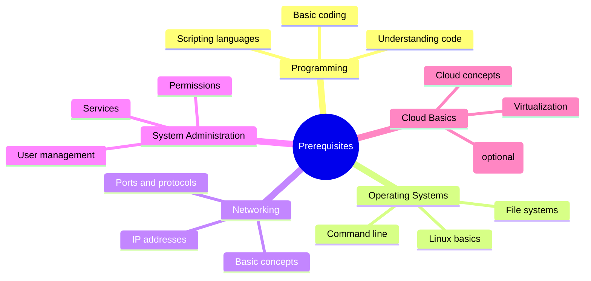
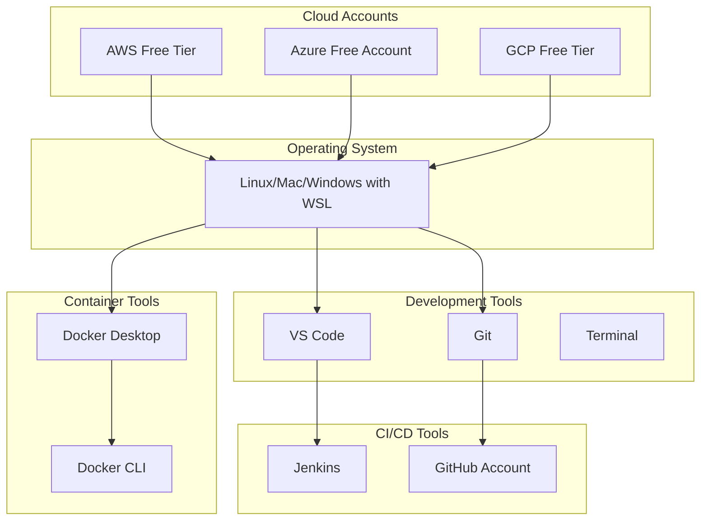

# 📋 Prerequisites & Setup Guide

Before diving into DevOps, ensure you have the necessary knowledge, tools, and environment setup. This guide will help you prepare for your DevOps journey.

---

## 🎯 What You Need to Know

### Essential Prerequisites



---

## 📚 Knowledge Prerequisites

### 1. Programming Basics

**Required Knowledge:**
- ✅ Basic understanding of programming concepts
- ✅ Ability to read and understand code
- ✅ Experience with at least one programming language
- ✅ Understanding of data structures and algorithms (basic level)

**Recommended Languages:**
- **Python**: Most popular for DevOps automation
- **Bash/Shell**: Essential for Linux operations
- **JavaScript/Node.js**: Common in modern applications
- **Go**: Growing in DevOps tools

**If You Need to Learn:**
- Python: [Python.org Tutorial](https://docs.python.org/3/tutorial/)
- Bash: Covered in [Linux Fundamentals](../02-linux-fundamentals/shell-scripting.md)

---

### 2. Linux Fundamentals

**Required Knowledge:**
- ✅ Basic Linux commands
- ✅ File system navigation
- ✅ File permissions
- ✅ Package management
- ✅ Process management

**Key Commands to Know:**
```bash
# File operations
ls, cd, pwd, mkdir, rm, cp, mv

# File viewing
cat, less, head, tail, grep

# Permissions
chmod, chown, sudo

# Process management
ps, top, kill, systemctl

# Package management
apt/yum (Ubuntu/RHEL)
```

**If You Need to Learn:**
- Complete [Linux Basics](../02-linux-fundamentals/linux-basics.md) section first

---

### 3. Networking Basics

**Required Knowledge:**
- ✅ Understanding of IP addresses (IPv4)
- ✅ Ports and protocols
- ✅ DNS concepts
- ✅ HTTP/HTTPS basics
- ✅ SSH basics

**Key Concepts:**
- IP addressing (192.168.1.1, 10.0.0.1)
- Common ports (22-SSH, 80-HTTP, 443-HTTPS, 3306-MySQL)
- DNS resolution
- Firewall concepts

**If You Need to Learn:**
- [Computer Networks Tutorial](https://www.geeksforgeeks.org/computer-network-tutorials/)
- Networking concepts will be covered in Cloud Platforms section

---

### 4. System Administration Basics

**Required Knowledge:**
- ✅ User and group management
- ✅ Service management
- ✅ Log management
- ✅ Backup concepts
- ✅ Basic troubleshooting

**If You Need to Learn:**
- Covered in [System Administration](../02-linux-fundamentals/system-administration.md)

---

## 🛠️ Required Tools & Software

### Development Environment Setup



---

## 📦 Installation Guide

### 1. Operating System Options

#### Option A: Linux (Recommended)
**Best for**: Native Linux experience

**Recommended Distributions:**
- **Ubuntu 22.04 LTS**: Most popular, great for beginners
- **CentOS/Rocky Linux**: Enterprise-focused
- **Fedora**: Latest features

**Installation:**
```bash
# Download from official website
# Create bootable USB
# Install alongside Windows or as primary OS
```

#### Option B: macOS
**Best for**: Mac users

**Setup:**
```bash
# Install Homebrew package manager
/bin/bash -c "$(curl -fsSL https://raw.githubusercontent.com/Homebrew/install/HEAD/install.sh)"

# Install tools via Homebrew
brew install git docker
```

#### Option C: Windows with WSL2
**Best for**: Windows users who want Linux experience

**Setup:**
```powershell
# Install WSL2
wsl --install -d Ubuntu-22.04

# Inside WSL2, install Docker
sudo apt update
sudo apt install docker.io
```

---

### 2. Version Control: Git

#### Installation

**Linux (Ubuntu/Debian):**
```bash
sudo apt update
sudo apt install git
git --version
```

**macOS:**
```bash
# Install via Homebrew
brew install git

# Or download from git-scm.com
```

**Windows:**
```bash
# Download Git for Windows from git-scm.com
# Or via WSL2 (recommended)
```

#### Configuration
```bash
# Set your identity
git config --global user.name "Your Name"
git config --global user.email "your.email@example.com"

# Set default editor
git config --global core.editor "code --wait"  # VS Code
# OR
git config --global core.editor "vim"

# Verify configuration
git config --list
```

---

### 3. Code Editor: VS Code

#### Installation

**Linux:**
```bash
# Download .deb package from code.visualstudio.com
# OR via snap
sudo snap install code --classic
```

**macOS:**
```bash
brew install --cask visual-studio-code
```

**Windows:**
- Download installer from code.visualstudio.com

#### Essential Extensions
```json
{
  "recommendations": [
    "ms-vscode.vscode-docker",
    "ms-kubernetes-tools.vscode-kubernetes-tools",
    "hashicorp.terraform",
    "redhat.ansible",
    "ms-azuretools.vscode-docker",
    "github.vscode-pull-request-github",
    "ms-python.python"
  ]
}
```

---

### 4. Container Platform: Docker

#### Installation

**Linux (Ubuntu):**
```bash
# Install Docker Engine
sudo apt update
sudo apt install docker.io docker-compose

# Start Docker service
sudo systemctl start docker
sudo systemctl enable docker

# Add user to docker group (optional)
sudo usermod -aG docker $USER
# Log out and log back in
```

**macOS:**
```bash
# Install Docker Desktop
brew install --cask docker

# Or download from docker.com/products/docker-desktop
```

**Windows:**
- Install Docker Desktop from docker.com/products/docker-desktop
- Requires WSL2

#### Verify Installation
```bash
docker --version
docker-compose --version
docker run hello-world
```

---

### 5. Container Orchestration: Kubernetes Tools

#### kubectl (Kubernetes CLI)

**Linux:**
```bash
curl -LO "https://dl.k8s.io/release/$(curl -L -s https://dl.k8s.io/release/stable.txt)/bin/linux/amd64/kubectl"
sudo install -o root -g root -m 0755 kubectl /usr/local/bin/kubectl
kubectl version --client
```

**macOS:**
```bash
brew install kubectl
```

**Windows:**
```powershell
# Via Chocolatey
choco install kubernetes-cli

# OR via WSL2
```

#### Minikube (Local Kubernetes)

**Linux:**
```bash
curl -LO https://storage.googleapis.com/minikube/releases/latest/minikube-linux-amd64
sudo install minikube-linux-amd64 /usr/local/bin/minikube
minikube start
```

**macOS:**
```bash
brew install minikube
minikube start
```

#### kind (Kubernetes in Docker)

```bash
# Linux/macOS
curl -Lo ./kind https://kind.sigs.k8s.io/dl/v0.20.0/kind-linux-amd64
chmod +x ./kind
sudo mv ./kind /usr/local/bin/kind

# Verify
kind --version
```

---

### 6. Infrastructure as Code Tools

#### Terraform

**Linux:**
```bash
# Download from terraform.io/downloads
wget https://releases.hashicorp.com/terraform/1.6.0/terraform_1.6.0_linux_amd64.zip
unzip terraform_1.6.0_linux_amd64.zip
sudo mv terraform /usr/local/bin/
terraform version
```

**macOS:**
```bash
brew install terraform
```

**Windows:**
- Download from terraform.io/downloads
- Add to PATH

#### Ansible

**Linux:**
```bash
sudo apt update
sudo apt install ansible
ansible --version
```

**macOS:**
```bash
brew install ansible
```

**Python Installation (Required for Ansible):**
```bash
# Most systems have Python pre-installed
python3 --version

# If not, install:
# Linux
sudo apt install python3 python3-pip

# macOS
brew install python3
```

---

### 7. CI/CD Tools

#### Jenkins

**Installation (via Docker - Recommended):**
```bash
docker run -d \
  --name jenkins \
  -p 8080:8080 \
  -p 50000:50000 \
  -v jenkins_home:/var/jenkins_home \
  jenkins/jenkins:lts
```

**Access Jenkins:**
- Open browser: http://localhost:8080
- Get initial password: `docker exec jenkins cat /var/jenkins_home/secrets/initialAdminPassword`

#### GitHub Account
1. Go to github.com
2. Sign up for free account
3. Create a repository
4. Generate SSH keys:
```bash
ssh-keygen -t ed25519 -C "your_email@example.com"
cat ~/.ssh/id_ed25519.pub
# Add to GitHub Settings > SSH and GPG keys
```

---

### 8. Cloud Platform Accounts

#### AWS Free Tier
1. Go to aws.amazon.com
2. Create free account
3. Access includes:
   - 12 months free tier
   - Always free services (Lambda, etc.)

#### Azure Free Account
1. Go to azure.microsoft.com
2. Sign up for free account
3. Includes $200 credit for 30 days

#### GCP Free Tier
1. Go to cloud.google.com
2. Sign up for free account
3. Includes $300 credit for 90 days

#### Setup Cloud CLI Tools

**AWS CLI:**
```bash
# Linux
curl "https://awscli.amazonaws.com/awscli-exe-linux-x86_64.zip" -o "awscliv2.zip"
unzip awscliv2.zip
sudo ./aws/install

# Configure
aws configure
```

**Azure CLI:**
```bash
# Linux
curl -sL https://aka.ms/InstallAzureCLIDeb | sudo bash

# Login
az login
```

**GCP CLI:**
```bash
# Linux
curl https://sdk.cloud.google.com | bash
exec -l $SHELL

# Initialize
gcloud init
```

---

## 🧪 Verify Your Setup

### Complete Verification Checklist

```bash
# 1. Git
git --version
git config --list

# 2. Docker
docker --version
docker-compose --version
docker run hello-world

# 3. Kubernetes
kubectl version --client
minikube version  # if installed
kind --version    # if installed

# 4. Terraform
terraform version

# 5. Ansible
ansible --version

# 6. Cloud CLIs
aws --version     # if using AWS
az --version      # if using Azure
gcloud --version  # if using GCP

# 7. Python
python3 --version
pip3 --version
```

---

## 🐳 Quick Start: Docker Hello World

Test your Docker installation:

```bash
# Run a simple container
docker run hello-world

# Run an interactive Ubuntu container
docker run -it ubuntu:latest bash

# Inside container:
ls -la
exit

# List containers
docker ps -a

# List images
docker images
```

---

## ☸️ Quick Start: Kubernetes Hello World

Test your Kubernetes setup with Minikube:

```bash
# Start Minikube
minikube start

# Check cluster status
kubectl cluster-info
kubectl get nodes

# Run a simple pod
kubectl run hello-world --image=nginx:latest

# Check pods
kubectl get pods

# Delete pod
kubectl delete pod hello-world

# Stop Minikube
minikube stop
```

---

## 📚 Additional Resources

### Official Documentation
- **Git**: [git-scm.com/docs](https://git-scm.com/docs)
- **Docker**: [docs.docker.com](https://docs.docker.com)
- **Kubernetes**: [kubernetes.io/docs](https://kubernetes.io/docs)
- **Terraform**: [terraform.io/docs](https://www.terraform.io/docs)
- **Ansible**: [docs.ansible.com](https://docs.ansible.com)

### Learning Platforms
- **Free**: GitHub Learning Lab, freeCodeCamp
- **Paid**: Udemy, Pluralsight, KodeKloud

---

## ⚠️ Troubleshooting Common Issues

### Docker Issues

**Problem**: Permission denied when running Docker
```bash
# Solution: Add user to docker group
sudo usermod -aG docker $USER
# Log out and log back in
```

**Problem**: Docker daemon not running
```bash
# Linux
sudo systemctl start docker
sudo systemctl enable docker

# macOS/Windows: Start Docker Desktop
```

### Git Issues

**Problem**: Git credentials not configured
```bash
git config --global user.name "Your Name"
git config --global user.email "your@email.com"
```

### Kubernetes Issues

**Problem**: Minikube won't start
```bash
# Check virtualization support
grep -E 'vmx|svm' /proc/cpuinfo

# Try with different driver
minikube start --driver=docker
```

---

## ✅ Pre-Flight Checklist

Before starting your DevOps journey, ensure:

- [ ] Git installed and configured
- [ ] VS Code installed with essential extensions
- [ ] Docker installed and working
- [ ] Kubernetes tools (kubectl) installed
- [ ] Terraform installed
- [ ] GitHub account created
- [ ] At least one cloud account (AWS/Azure/GCP) created
- [ ] Linux environment ready (or WSL2 on Windows)
- [ ] Terminal comfortable to use
- [ ] Basic programming knowledge

---

## 🚀 Next Steps

Once you've completed the prerequisites:

1. ✅ Verify all installations
2. ✅ Complete quick start exercises
3. ✅ Read [Introduction to DevOps](./introduction-to-devops.md)
4. ✅ Review [Learning Path](./learning-path.md)
5. ✅ Start with [Git Fundamentals](../01-version-control/git-fundamentals.md)

---

**Author**: Chinmaya Jena  
**Last Updated**: January 2025  
**Version**: 1.0

