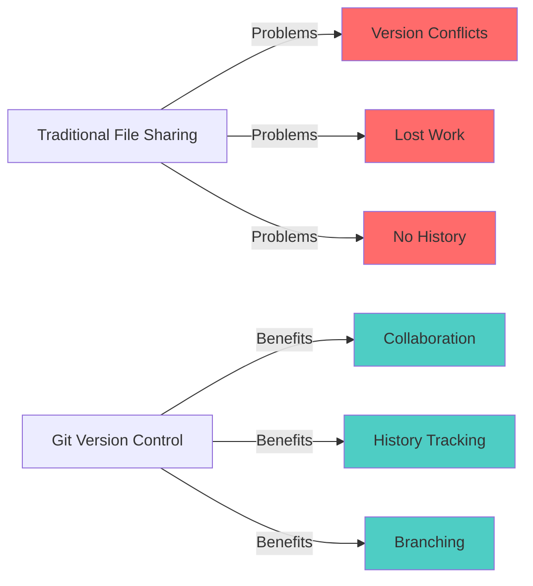
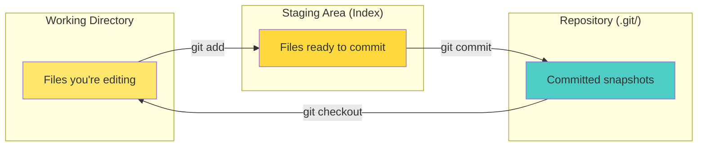
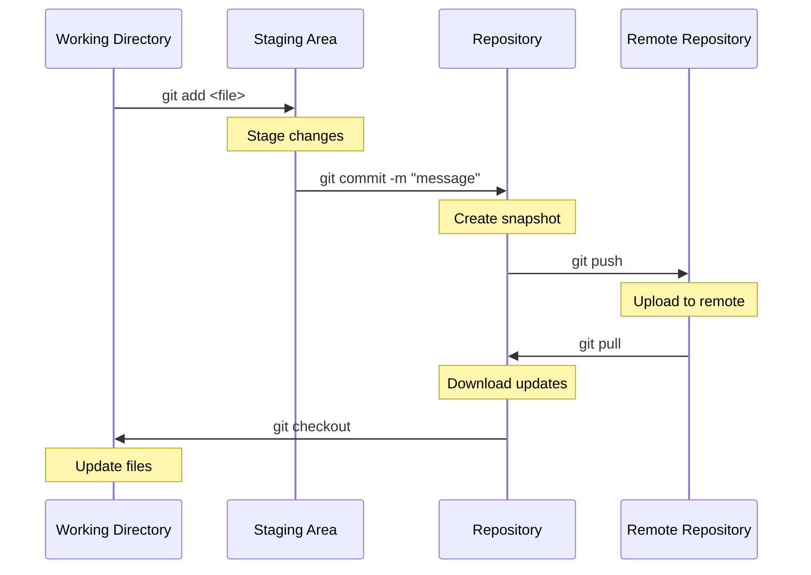
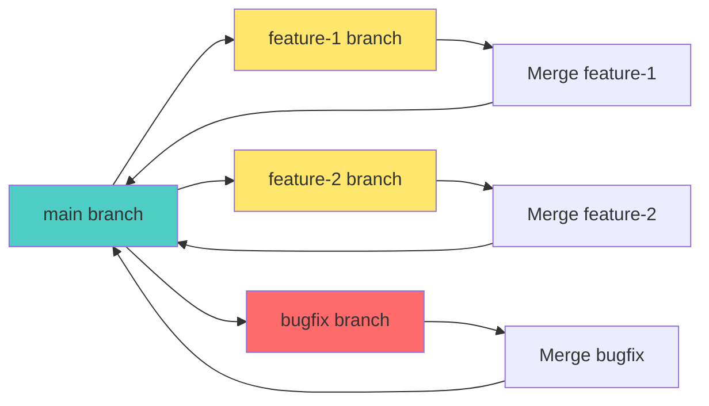
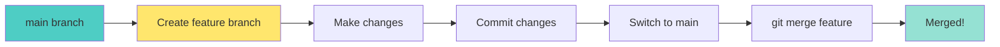
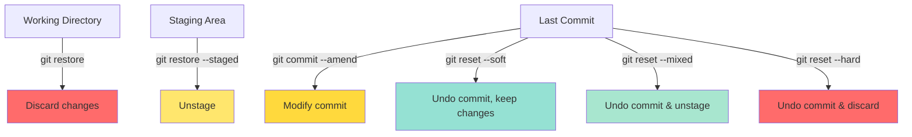

# 📦 Git Fundamentals - Complete Guide

> "Git has the power to make you look like you know what you're doing." - Scott Chacon

Git is a distributed version control system that tracks changes in files and coordinates work among multiple developers. It's an essential tool in every DevOps engineer's toolkit.

---

## 🎯 What is Git?

**Git** is a distributed version control system (DVCS) designed to handle everything from small to very large projects with speed and efficiency.

### Why Git?



**Key Features:**
- ✅ **Distributed**: Every developer has a full copy
- ✅ **Fast**: Local operations are instant
- ✅ **Branching**: Easy branch creation and merging
- ✅ **History**: Complete change history
- ✅ **Open Source**: Free and widely adopted

---

## 🏗️ Git Architecture

### Three Main Areas



**1. Working Directory**
- Files you're currently editing
- Can be modified, staged, or untracked

**2. Staging Area (Index)**
- Temporary area for changes before commit
- Allows selective commits

**3. Repository (.git/)**
- Permanent snapshot of your project
- Contains all commits and history

---

## 🚀 Essential Git Commands

### Basic Workflow



### 1. Initialization & Configuration

```bash
# Initialize a repository
git init

# Configure user identity
git config --global user.name "Your Name"
git config --global user.email "your.email@example.com"

# Check configuration
git config --list
```

### 2. Basic Operations

```bash
# Check repository status
git status

# Add files to staging
git add <file>          # Add specific file
git add .               # Add all files in current directory
git add *.js            # Add all .js files

# Commit changes
git commit -m "Your commit message"

# View commit history
git log
git log --oneline       # Compact view
git log --graph         # With branch graph
```

### 3. Working with Remotes

```bash
# Add remote repository
git remote add origin <repository-url>

# View remotes
git remote -v

# Push to remote
git push origin main

# Pull from remote
git pull origin main

# Clone a repository
git clone <repository-url>
```

---

## 🌿 Branching Fundamentals

### What are Branches?

Branches allow you to work on different features simultaneously without affecting the main codebase.



### Branch Operations

```bash
# Create a new branch
git branch <branch-name>

# Switch to a branch
git checkout <branch-name>

# Create and switch in one command
git checkout -b <branch-name>

# List all branches
git branch                    # Local branches
git branch -a                 # All branches (including remote)

# Delete a branch
git branch -d <branch-name>   # Safe delete (only if merged)
git branch -D <branch-name>   # Force delete

# Rename a branch
git branch -m <old-name> <new-name>
```

### Modern Git: `git switch` and `git restore`

```bash
# Switch branches (newer syntax)
git switch <branch-name>
git switch -c <branch-name>   # Create and switch

# Restore files (undo changes)
git restore <file>            # Discard working directory changes
git restore --staged <file>   # Unstage a file
```

---

## 🔀 Merging

### Merge Process



### Merge Commands

```bash
# Merge a branch into current branch
git merge <branch-name>

# Merge with no fast-forward (creates merge commit)
git merge --no-ff <branch-name>

# Abort a merge in progress
git merge --abort

# Squash merge (combines all commits into one)
git merge --squash <branch-name>
```

### Merge Conflicts

When Git cannot automatically merge changes, conflicts occur:

```bash
# Check for conflicts
git status

# Resolve conflicts in files
# Edit files to resolve conflicts
# Look for conflict markers:
# <<<<<<< HEAD
# Your changes
# =======
# Their changes
# >>>>>>> branch-name

# After resolving:
git add <resolved-file>
git commit -m "Merge branch 'feature'"
```

---

## 📋 Common Git Workflows

### 1. Basic Workflow

```bash
# Daily workflow
git status                    # Check what changed
git add .                     # Stage changes
git commit -m "Description"   # Commit
git push                      # Push to remote
```

### 2. Feature Branch Workflow

```bash
# Create feature branch
git checkout -b feature/new-feature

# Make changes and commit
git add .
git commit -m "Add new feature"

# Push branch
git push origin feature/new-feature

# Merge to main
git checkout main
git pull origin main
git merge feature/new-feature
git push origin main
```

### 3. Stashing Work

```bash
# Save current work temporarily
git stash

# List stashes
git stash list

# Apply stash
git stash apply               # Keeps stash
git stash pop                 # Applies and removes stash

# Drop stash
git stash drop
```

---

## 📖 Viewing History

### Commit History

```bash
# View detailed log
git log

# One-line format
git log --oneline

# With graph
git log --graph --oneline --all

# Last N commits
git log -n 5

# Show changes in commits
git log -p

# Search commits by message
git log --grep="keyword"

# Filter by author
git log --author="name"
```

### Viewing Changes

```bash
# Show changes in working directory
git diff

# Show staged changes
git diff --staged

# Show changes in specific commit
git show <commit-hash>

# Compare two commits
git diff <commit1> <commit2>

# Show changes in a branch
git diff main..feature-branch
```

---

## 🔄 Undoing Changes

### Different Scenarios



### Undo Commands

```bash
# Discard changes in working directory
git restore <file>
git checkout -- <file>        # Older syntax

# Unstage a file
git restore --staged <file>
git reset HEAD <file>         # Older syntax

# Modify last commit
git commit --amend -m "New message"

# Undo last commit (keep changes)
git reset --soft HEAD~1

# Undo last commit and unstage
git reset HEAD~1              # Same as --mixed

# Undo last commit and discard changes
git reset --hard HEAD~1       # ⚠️ Dangerous!

# Revert a commit (creates new commit)
git revert <commit-hash>
```

---

## 🔍 Finding Information

### Useful Commands

```bash
# Find which commit introduced a line
git blame <file>

# Search for text in history
git log -S "search text"

# Find commits that touched a file
git log --follow <file>

# Show file at specific commit
git show <commit>:<file>

# Find lost commits
git reflog
```

---

## 🏷️ Tags

Tags mark specific points in history (releases, versions).

```bash
# Create annotated tag
git tag -a v1.0.0 -m "Release version 1.0.0"

# List tags
git tag

# Show tag details
git show v1.0.0

# Push tags to remote
git push origin v1.0.0
git push origin --tags        # Push all tags

# Delete tag
git tag -d v1.0.0
git push origin --delete v1.0.0
```

---

## 🌐 Remote Operations

### Remote Repository Management

```bash
# Add remote
git remote add <name> <url>
git remote add origin https://github.com/user/repo.git

# View remotes
git remote -v

# Rename remote
git remote rename <old> <new>

# Remove remote
git remote remove <name>

# Update remote URL
git remote set-url origin <new-url>
```

### Fetch vs Pull

```bash
# Fetch (download without merging)
git fetch origin
git fetch origin main

# Pull (fetch + merge)
git pull origin main

# Pull with rebase
git pull --rebase origin main
```

---

## 🎯 Best Practices

### 1. Commit Messages

**Good commit messages:**
- ✅ Use imperative mood: "Add feature" not "Added feature"
- ✅ First line < 50 characters
- ✅ Capitalize first letter
- ✅ No period at end
- ✅ Explain what and why

**Example:**
```
Add user authentication

Implement login and registration functionality with JWT tokens.
Includes password hashing and session management.

Closes #123
```

### 2. Branch Naming

**Conventions:**
- `feature/feature-name` - New features
- `bugfix/bug-description` - Bug fixes
- `hotfix/critical-fix` - Urgent fixes
- `refactor/description` - Code refactoring

### 3. Regular Commits

- ✅ Commit frequently
- ✅ One logical change per commit
- ✅ Test before committing
- ✅ Don't commit broken code

### 4. .gitignore

Create a `.gitignore` file to exclude files:

```gitignore
# Dependencies
node_modules/
vendor/

# Build outputs
dist/
build/
*.class

# IDE files
.idea/
.vscode/
*.swp

# Environment files
.env
.env.local

# OS files
.DS_Store
Thumbs.db
```

---

## 🚨 Common Mistakes & Solutions

### 1. Committed Wrong Files

```bash
# Undo last commit, keep changes
git reset --soft HEAD~1

# Remove file from last commit
git reset HEAD~1 <file>
git commit --amend
```

### 2. Wrong Commit Message

```bash
git commit --amend -m "Correct message"
```

### 3. Need to Undo Public Commit

```bash
# Don't use reset! Use revert
git revert <commit-hash>
```

### 4. Forgot to Create Branch

```bash
# Create branch from current position
git branch <new-branch>
git checkout <new-branch>

# Or move commits to new branch
git branch <new-branch>
git reset --hard origin/main
```

---

## 📚 Next Steps

Now that you understand Git fundamentals:

1. **Practice**: Create a test repository and practice commands
2. **Learn Advanced Git** → [Advanced Git Techniques](./git-advanced.md)
3. **Study Branching Strategies** → [Branching Strategies](./branching-strategies.md)

---

## 🎓 Key Takeaways

- ✅ Git tracks changes in files across time
- ✅ Three main areas: Working Directory, Staging Area, Repository
- ✅ Branching allows parallel development
- ✅ Commits create snapshots of your project
- ✅ Always write clear commit messages
- ✅ Use `.gitignore` to exclude unnecessary files

---

## 📖 Additional Resources

- **Official Git Documentation**: [git-scm.com/docs](https://git-scm.com/docs)
- **GitHub Learning Lab**: [lab.github.com](https://lab.github.com)
- **Atlassian Git Tutorials**: [atlassian.com/git/tutorials](https://www.atlassian.com/git/tutorials)

---

**Author**: Chinmaya Jena  
**Last Updated**: January 2025  
**Version**: 1.0

