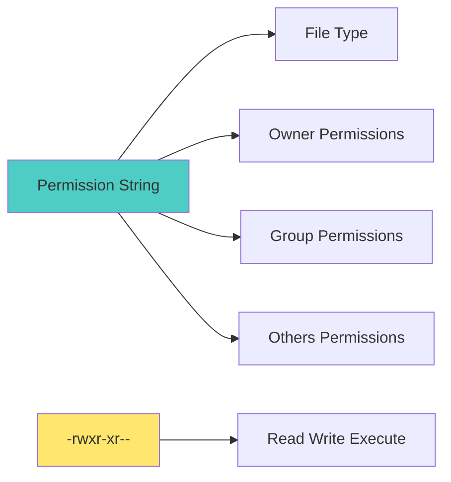

# 🐧 Linux Basics for DevOps - Complete Guide

> "Linux is the foundation of modern DevOps infrastructure."

Linux is an essential skill for every DevOps engineer. This guide covers the Linux fundamentals you need to work effectively in DevOps.

---

## 🎯 Why Linux for DevOps?

Most DevOps tools and platforms run on Linux:
- ✅ Container platforms (Docker, Kubernetes)
- ✅ CI/CD servers (Jenkins, GitLab CI)
- ✅ Cloud servers (EC2, Azure VMs, GCP VMs)
- ✅ Infrastructure automation tools

---

## 📂 File System Structure

### Linux Directory Tree

```mermaid
graph TD
    A[/ Root Directory] --> B[/bin - Binary executables]
    A --> C[/etc - Configuration files]
    A --> D[/home - User directories]
    A --> E[/var - Variable data]
    A --> F[/usr - User programs]
    A --> G[/tmp - Temporary files]
    A --> H[/opt - Optional software]
    A --> I[/root - Root user home]
    
    style A fill:#4ecdc4
```

### Important Directories

| Directory | Purpose | Example |
|-----------|---------|---------|
| `/bin` | Essential binaries | `ls`, `cat`, `cp` |
| `/etc` | Configuration files | `nginx.conf`, `passwd` |
| `/home` | User home directories | `/home/username` |
| `/var` | Variable data | `/var/log`, `/var/www` |
| `/usr` | User programs | `/usr/bin`, `/usr/lib` |
| `/tmp` | Temporary files | Cleared on reboot |
| `/opt` | Optional software | Third-party applications |
| `/root` | Root user home | Administrator files |

---

## 🔤 Essential Linux Commands

### File Navigation

```bash
# Change directory
cd /path/to/directory
cd ..              # Parent directory
cd ~               # Home directory
cd -               # Previous directory

# List files
ls                 # List current directory
ls -l              # Long format
ls -a              # All files (including hidden)
ls -la             # Long format, all files
ls -lh             # Human-readable sizes

# Print working directory
pwd

# Create directory
mkdir directory-name
mkdir -p path/to/directory  # Create parent directories

# Remove directory
rmdir directory-name        # Empty directory only
rm -r directory-name        # Recursive (careful!)
rm -rf directory-name       # Force recursive (dangerous!)
```

### File Operations

```bash
# Copy files
cp source.txt destination.txt
cp -r source-dir destination-dir  # Recursive copy

# Move/rename files
mv old-name.txt new-name.txt
mv file.txt /path/to/destination/

# Remove files
rm file.txt
rm -f file.txt              # Force (no confirmation)
rm -r directory/            # Recursive

# Create file
touch file.txt

# View file contents
cat file.txt                # Display entire file
less file.txt               # Page through file (use q to quit)
head file.txt               # First 10 lines
tail file.txt               # Last 10 lines
tail -f file.txt            # Follow file (for logs)

# Search in files
grep "pattern" file.txt
grep -r "pattern" /path/    # Recursive search
grep -i "pattern" file.txt  # Case-insensitive
```

---

## 📊 File Permissions

### Understanding Permissions



### Permission Format

```
-rwxr-xr--
| |  |  |
| |  |  +-- Others: r--
| |  +----- Group: r-x
| +-------- Owner: rwx
+---------- Type: - (file), d (directory), l (link)
```

### Permission Values

- `r` (read) = 4
- `w` (write) = 2
- `x` (execute) = 1

**Example:**
- `rwx` = 4 + 2 + 1 = 7
- `r-x` = 4 + 0 + 1 = 5
- `r--` = 4 + 0 + 0 = 4

### Permission Commands

```bash
# Change permissions (numeric)
chmod 755 file.txt          # rwxr-xr-x
chmod 644 file.txt          # rw-r--r--
chmod 777 file.txt          # rwxrwxrwx (not recommended!)

# Change permissions (symbolic)
chmod u+x file.txt          # Add execute for owner
chmod g-w file.txt          # Remove write for group
chmod o+r file.txt          # Add read for others
chmod a+x file.txt          # Add execute for all

# Change ownership
chown user:group file.txt
chown -R user:group directory/  # Recursive

# Change group
chgrp group-name file.txt
```

---

## 🔍 Text Processing

### Common Text Tools

```bash
# View file contents
cat file.txt                # Concatenate and display
less file.txt               # Page through (better for large files)
more file.txt               # Page through (older version)

# Search and filter
grep "pattern" file.txt
grep -v "pattern" file.txt  # Invert match (exclude)
grep -n "pattern" file.txt  # Show line numbers
grep -A 3 "pattern" file.txt  # After context (3 lines)
grep -B 3 "pattern" file.txt  # Before context (3 lines)

# Text manipulation
cut -d',' -f1 file.txt      # Cut fields (delimiter: comma, field 1)
awk '{print $1}' file.txt   # Print first field
sed 's/old/new/g' file.txt  # Find and replace

# Sort and filter
sort file.txt
sort -r file.txt            # Reverse sort
sort -n file.txt            # Numeric sort
uniq file.txt               # Remove duplicates (requires sorted input)
```

---

## 🔧 Process Management

### Process Commands

```bash
# List processes
ps                          # Current processes
ps aux                      # All processes (detailed)
ps aux | grep nginx         # Filter processes

# List processes in real-time
top                         # Interactive process viewer
htop                        # Better version (if installed)

# Kill processes
kill <PID>                  # Terminate process
kill -9 <PID>               # Force kill
killall process-name        # Kill by name
pkill process-name          # Kill by pattern

# Background/foreground
command &                   # Run in background
jobs                        # List background jobs
fg %1                       # Bring job 1 to foreground
bg %1                       # Send job 1 to background

# Nice (priority)
nice -n 10 command          # Run with lower priority
renice 10 <PID>             # Change priority of running process
```

---

## 📦 Package Management

### Debian/Ubuntu (apt)

```bash
# Update package list
sudo apt update

# Upgrade packages
sudo apt upgrade

# Install package
sudo apt install package-name

# Remove package
sudo apt remove package-name
sudo apt purge package-name  # Remove with config files

# Search packages
apt search keyword

# List installed packages
apt list --installed

# Clean up
sudo apt autoremove
sudo apt autoclean
```

### RHEL/CentOS (yum/dnf)

```bash
# Update packages
sudo yum update
sudo dnf update

# Install package
sudo yum install package-name
sudo dnf install package-name

# Remove package
sudo yum remove package-name
sudo dnf remove package-name

# Search packages
yum search keyword
dnf search keyword

# List installed packages
yum list installed
dnf list installed
```

---

## 🌐 Networking

### Network Commands

```bash
# Network configuration
ip addr show                # Show IP addresses
ifconfig                    # Show interfaces (older)
ip route show               # Show routing table
netstat -tulpn              # Show network connections
ss -tulpn                   # Modern alternative to netstat

# Test connectivity
ping google.com
ping -c 4 google.com        # 4 packets
curl https://example.com    # Download URL
wget https://example.com    # Download file

# DNS
nslookup domain.com
dig domain.com              # DNS lookup tool
host domain.com             # Simple DNS lookup

# Port testing
telnet host port
nc -zv host port            # netcat
```

---

## 📝 System Administration

### System Information

```bash
# System info
uname -a                    # System information
hostname                    # Hostname
uptime                      # System uptime and load
free -h                     # Memory usage
df -h                       # Disk usage
du -sh /path                # Directory size

# CPU info
lscpu                       # CPU information
cat /proc/cpuinfo           # Detailed CPU info

# Memory info
cat /proc/meminfo           # Memory information
```

### System Services

```bash
# Systemd (modern Linux)
systemctl status service-name
systemctl start service-name
systemctl stop service-name
systemctl restart service-name
systemctl enable service-name    # Start on boot
systemctl disable service-name
systemctl list-units --type=service

# SysV init (older systems)
service service-name status
service service-name start
service service-name stop
service service-name restart
```

---

## 🔐 User Management

### User Commands

```bash
# Current user
whoami                      # Current username
id                          # User ID and groups
groups                      # User groups

# Switch user
su username                 # Switch user
sudo command                # Run as root
sudo su -                   # Switch to root

# User management (requires root)
useradd username            # Add user
userdel username            # Delete user
usermod -aG group username  # Add user to group
passwd username             # Change password
```

---

## 📋 Shell Scripting Basics

### Basic Script Structure

```bash
#!/bin/bash
# This is a comment

# Variables
NAME="John"
echo "Hello, $NAME"

# Command substitution
DATE=$(date)
echo "Current date: $DATE"

# If statement
if [ -f "file.txt" ]; then
    echo "File exists"
else
    echo "File does not exist"
fi

# Loop
for i in {1..5}; do
    echo "Number: $i"
done
```

### Common Shell Variables

```bash
# Environment variables
echo $HOME                  # Home directory
echo $PATH                  # Command search path
echo $USER                  # Current user
echo $PWD                   # Current directory

# Special variables
$0                          # Script name
$1, $2, ...                 # Command-line arguments
$#                          # Number of arguments
$?                          # Exit status of last command
```

---

## 🎯 DevOps-Specific Linux Skills

### File Monitoring

```bash
# Monitor log files
tail -f /var/log/nginx/access.log
tail -f /var/log/syslog

# Watch file changes
watch -n 1 'ls -la'
```

### System Resources

```bash
# Monitor system resources
htop                        # Interactive process viewer
iotop                       # I/O usage
nethogs                     # Network usage per process

# Disk I/O
iostat -x 1                 # Disk I/O statistics
```

### Cron Jobs

```bash
# Edit crontab
crontab -e

# Crontab format
# * * * * * command
# | | | | |
# | | | | +-- Day of week (0-7)
# | | | +---- Month (1-12)
# | | +------ Day of month (1-31)
# | +-------- Hour (0-23)
# +---------- Minute (0-59)

# Examples
0 * * * * /path/to/script.sh        # Every hour
0 0 * * * /path/to/script.sh        # Daily at midnight
*/5 * * * * /path/to/script.sh      # Every 5 minutes
```

---

## 📚 Next Steps

Now that you understand Linux basics:

1. **Practice**: Work through exercises daily
2. **Learn Shell Scripting** → [Shell Scripting Guide](./shell-scripting.md)
3. **Study System Administration** → [System Administration](./system-administration.md)

---

## 🎓 Key Takeaways

- ✅ Linux is essential for DevOps
- ✅ Master file system navigation
- ✅ Understand file permissions
- ✅ Learn process management
- ✅ Practice shell scripting
- ✅ Know package management
- ✅ Understand networking basics

---

**Author**: Chinmaya Jena  
**Last Updated**: January 2025  
**Version**: 1.0

