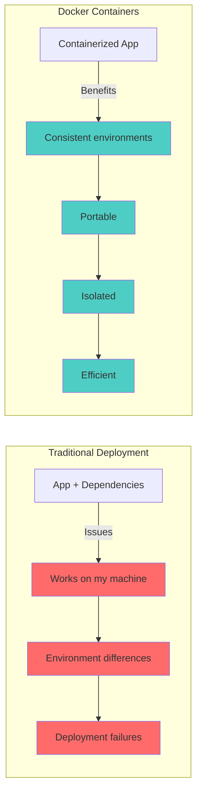
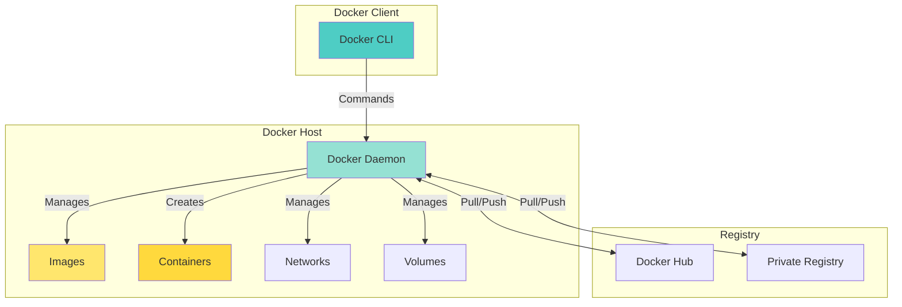
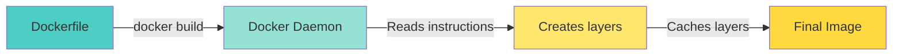
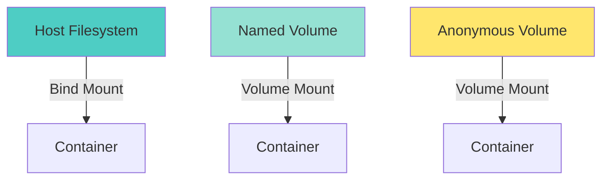
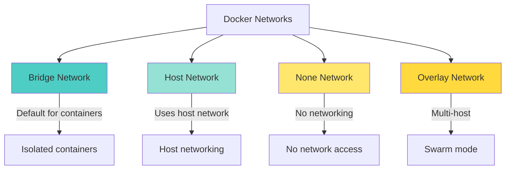

# 🐳 Docker Fundamentals - Complete Guide

> "Docker is a platform for developers and sysadmins to develop, deploy, and run applications with containers." - Docker Inc.

Docker is the leading containerization platform that packages applications and their dependencies into lightweight, portable containers that can run consistently across different environments.

---

## 🎯 What is Docker?

**Docker** is an open-source platform that uses OS-level virtualization to deliver software in packages called containers. Containers are isolated from each other and bundle their own software, libraries, and configuration files.

### Why Docker?



**Key Benefits:**
- ✅ **Consistency**: Same environment across dev, test, and prod
- ✅ **Portability**: Run anywhere Docker is installed
- ✅ **Isolation**: Containers don't interfere with each other
- ✅ **Efficiency**: Lightweight compared to VMs
- ✅ **Scalability**: Easy to scale applications

---

## 🏗️ Docker Architecture

### Core Components



### Key Concepts

**1. Image**
- Read-only template for creating containers
- Contains application code, runtime, dependencies
- Built from Dockerfile or pulled from registry

**2. Container**
- Running instance of an image
- Isolated environment with its own filesystem
- Can be started, stopped, and deleted

**3. Dockerfile**
- Text file with instructions to build an image
- Contains commands to install dependencies and configure the app

**4. Registry**
- Repository for Docker images
- Docker Hub (public) or private registries
- Allows sharing and versioning images

---

## 🚀 Essential Docker Commands

### 1. Working with Images

```bash
# Pull an image from registry
docker pull <image-name>:<tag>
docker pull nginx:latest
docker pull python:3.9

# List images
docker images
docker image ls

# Remove an image
docker rmi <image-id>
docker image rm <image-name>

# Build an image from Dockerfile
docker build -t <image-name> .
docker build -t myapp:1.0 .

# Inspect an image
docker inspect <image-name>

# Search images on Docker Hub
docker search <keyword>
```

### 2. Working with Containers

```bash
# Run a container
docker run <image-name>
docker run nginx

# Run in detached mode (background)
docker run -d <image-name>
docker run -d nginx

# Run with custom name
docker run --name my-nginx nginx

# Run with port mapping
docker run -p 8080:80 nginx

# Run with environment variables
docker run -e KEY=value nginx

# Run with volume mount
docker run -v /host/path:/container/path nginx

# List running containers
docker ps

# List all containers (including stopped)
docker ps -a

# Stop a container
docker stop <container-id>

# Start a stopped container
docker start <container-id>

# Remove a container
docker rm <container-id>
docker rm -f <container-id>  # Force remove running container

# Execute command in running container
docker exec -it <container-id> bash

# View container logs
docker logs <container-id>
docker logs -f <container-id>  # Follow logs

# Inspect a container
docker inspect <container-id>
```

### 3. Advanced Container Operations

```bash
# Run with resource limits
docker run --memory="512m" --cpus="1.0" nginx

# Run with restart policy
docker run --restart=always nginx

# Run in privileged mode
docker run --privileged nginx

# Run with network
docker run --network=bridge nginx
```

---

## 📝 Dockerfile Basics

### Dockerfile Structure

```dockerfile
# Base image
FROM python:3.9-slim

# Set working directory
WORKDIR /app

# Copy requirements first (for layer caching)
COPY requirements.txt .

# Install dependencies
RUN pip install --no-cache-dir -r requirements.txt

# Copy application code
COPY . .

# Expose port
EXPOSE 8000

# Set environment variables
ENV PYTHONUNBUFFERED=1

# Define default command
CMD ["python", "app.py"]
```

### Dockerfile Instructions

| Instruction | Description | Example |
|------------|-------------|---------|
| `FROM` | Base image | `FROM ubuntu:20.04` |
| `WORKDIR` | Set working directory | `WORKDIR /app` |
| `COPY` | Copy files from host | `COPY . /app` |
| `ADD` | Copy files (can extract) | `ADD app.tar.gz /app` |
| `RUN` | Execute commands | `RUN apt-get update` |
| `CMD` | Default command | `CMD ["npm", "start"]` |
| `ENTRYPOINT` | Entry point command | `ENTRYPOINT ["python"]` |
| `ENV` | Environment variable | `ENV NODE_ENV=production` |
| `ARG` | Build-time variable | `ARG VERSION=1.0` |
| `EXPOSE` | Document port | `EXPOSE 8080` |
| `VOLUME` | Create mount point | `VOLUME /data` |
| `USER` | Set user | `USER node` |
| `LABEL` | Add metadata | `LABEL version="1.0"` |

---

## 🔨 Building Docker Images

### Build Process



### Build Commands

```bash
# Build from Dockerfile in current directory
docker build .

# Build with tag
docker build -t myapp:1.0 .

# Build with tag and latest
docker build -t myapp:1.0 -t myapp:latest .

# Build with build context
docker build -t myapp:1.0 /path/to/dockerfile

# Build with build arguments
docker build --build-arg VERSION=1.0 -t myapp:1.0 .

# Build without cache
docker build --no-cache -t myapp:1.0 .

# Build with specific Dockerfile
docker build -f Dockerfile.prod -t myapp:prod .
```

### Layer Caching Strategy

```dockerfile
# ❌ Bad: Changes invalidate all layers
FROM python:3.9
COPY . .
RUN pip install -r requirements.txt

# ✅ Good: Changes only invalidate necessary layers
FROM python:3.9
COPY requirements.txt .
RUN pip install -r requirements.txt
COPY . .
```

---

## 📦 Docker Volumes

### What are Volumes?

Volumes are used to persist data and share data between containers and the host.



### Volume Operations

```bash
# Create a volume
docker volume create myvolume

# List volumes
docker volume ls

# Inspect a volume
docker volume inspect myvolume

# Remove a volume
docker volume rm myvolume

# Remove unused volumes
docker volume prune

# Use volume in container
docker run -v myvolume:/data nginx

# Bind mount (host path)
docker run -v /host/path:/container/path nginx

# Read-only mount
docker run -v /host/path:/container/path:ro nginx
```

---

## 🌐 Docker Networking

### Network Types



### Network Commands

```bash
# List networks
docker network ls

# Create a network
docker network create mynetwork

# Inspect a network
docker network inspect mynetwork

# Connect container to network
docker network connect mynetwork container-name

# Disconnect container from network
docker network disconnect mynetwork container-name

# Remove a network
docker network rm mynetwork

# Run container with specific network
docker run --network=mynetwork nginx

# Create network with subnet
docker network create --subnet=172.20.0.0/16 mynetwork
```

---

## 🎯 Docker Compose Basics

Docker Compose allows you to define and run multi-container Docker applications.

### docker-compose.yml Example

```yaml
version: '3.8'

services:
  web:
    image: nginx:latest
    ports:
      - "8080:80"
    volumes:
      - ./html:/usr/share/nginx/html
    networks:
      - app-network

  database:
    image: postgres:13
    environment:
      POSTGRES_DB: mydb
      POSTGRES_USER: user
      POSTGRES_PASSWORD: password
    volumes:
      - db-data:/var/lib/postgresql/data
    networks:
      - app-network

volumes:
  db-data:

networks:
  app-network:
    driver: bridge
```

### Docker Compose Commands

```bash
# Start services
docker-compose up

# Start in detached mode
docker-compose up -d

# Build images before starting
docker-compose up --build

# Stop services
docker-compose down

# View logs
docker-compose logs
docker-compose logs -f web

# Execute command in service
docker-compose exec web bash

# Scale services
docker-compose up --scale web=3

# List services
docker-compose ps
```

---

## 🔍 Docker Inspect & Debugging

### Inspect Commands

```bash
# Inspect container
docker inspect <container-id>

# Inspect image
docker inspect <image-name>

# Inspect network
docker inspect <network-name>

# Inspect volume
docker inspect <volume-name>

# Get specific information
docker inspect -f '{{.State.Status}}' <container-id>
docker inspect -f '{{.Config.ExposedPorts}}' <container-id>
```

### Debugging Containers

```bash
# View container logs
docker logs <container-id>
docker logs -f <container-id>  # Follow
docker logs --tail 100 <container-id>  # Last 100 lines

# Execute interactive shell
docker exec -it <container-id> bash
docker exec -it <container-id> sh

# View container processes
docker top <container-id>

# View container stats
docker stats
docker stats <container-id>

# View events
docker events
```

---

## 🏷️ Image Tagging & Versioning

### Tagging Strategies

```bash
# Tag an image
docker tag <source-image> <target-image>:<tag>
docker tag myapp:latest myapp:1.0
docker tag myapp:latest myregistry.com/myapp:1.0

# Multiple tags
docker tag myapp:latest myapp:1.0
docker tag myapp:latest myapp:stable

# Push tagged image
docker push myregistry.com/myapp:1.0

# Tag from commit or build number
docker tag myapp:latest myapp:$(git rev-parse --short HEAD)
```

### Versioning Best Practices

```bash
# Semantic versioning
myapp:1.0.0        # Major.Minor.Patch
myapp:1.0          # Major.Minor
myapp:1            # Major

# Environment tags
myapp:dev
myapp:staging
myapp:prod

# Git-based tags
myapp:git-abc1234  # Commit hash
myapp:main         # Branch name
```

---

## 📊 Docker Best Practices

### 1. Dockerfile Best Practices

```dockerfile
# ✅ Use specific tags, not 'latest'
FROM python:3.9-slim

# ✅ Use multi-stage builds for smaller images
FROM python:3.9-slim AS builder
WORKDIR /app
COPY requirements.txt .
RUN pip install --user -r requirements.txt

FROM python:3.9-slim
WORKDIR /app
COPY --from=builder /root/.local /root/.local
COPY . .

# ✅ Don't run as root
RUN useradd -m -u 1000 appuser
USER appuser

# ✅ Use .dockerignore
# ✅ Combine RUN commands
RUN apt-get update && \
    apt-get install -y package && \
    rm -rf /var/lib/apt/lists/*

# ✅ Use COPY instead of ADD
COPY . /app

# ✅ Set WORKDIR before COPY
WORKDIR /app
COPY . .
```

### 2. Container Best Practices

```bash
# ✅ Limit resources
docker run --memory="512m" --cpus="1.0" nginx

# ✅ Use restart policies
docker run --restart=unless-stopped nginx

# ✅ Use health checks
HEALTHCHECK --interval=30s --timeout=3s \
  CMD curl -f http://localhost/ || exit 1

# ✅ Use environment variables for configuration
docker run -e DATABASE_URL=postgres://... app

# ✅ Use volumes for persistent data
docker run -v db-data:/var/lib/postgresql/data postgres
```

### 3. Security Best Practices

```bash
# ✅ Scan images for vulnerabilities
docker scan <image-name>

# ✅ Don't store secrets in images
# Use secrets management (Vault, AWS Secrets Manager)

# ✅ Use minimal base images
FROM alpine:latest  # Instead of ubuntu:latest

# ✅ Run as non-root user
USER appuser

# ✅ Keep images updated
docker pull <image-name>:latest
```

---

## 🚨 Common Docker Issues & Solutions

### Issue 1: Port Already in Use

```bash
# Solution: Use different port or stop conflicting container
docker run -p 8081:80 nginx  # Use different host port
docker ps  # Find conflicting container
docker stop <container-id>
```

### Issue 2: Out of Disk Space

```bash
# Solution: Clean up unused resources
docker system prune
docker system prune -a  # Remove unused images too
docker volume prune
```

### Issue 3: Container Exits Immediately

```bash
# Solution: Check logs and ensure container has a long-running process
docker logs <container-id>
# Ensure CMD or ENTRYPOINT points to a long-running process
```

### Issue 4: Can't Connect to Container

```bash
# Solution: Check network and port mapping
docker ps  # Verify container is running
docker inspect <container-id>  # Check network settings
docker logs <container-id>  # Check application logs
```

---

## 📚 Next Steps

Now that you understand Docker fundamentals:

1. **Practice**: Build your first Docker image
2. **Learn Advanced Docker** → [Docker Advanced Concepts](./docker-advanced.md)
3. **Study Best Practices** → [Dockerfile Best Practices](./dockerfile-best-practices.md)
4. **Learn Docker Compose** → [Docker Compose Guide](../docker-compose/docker-compose-guide.md)

---

## 🎓 Key Takeaways

- ✅ Docker packages applications into portable containers
- ✅ Images are read-only templates, containers are running instances
- ✅ Dockerfile defines how to build images
- ✅ Volumes persist data beyond container lifecycle
- ✅ Networks enable container communication
- ✅ Docker Compose simplifies multi-container applications

---

## 📖 Additional Resources

- **Official Docker Documentation**: [docs.docker.com](https://docs.docker.com)
- **Docker Hub**: [hub.docker.com](https://hub.docker.com)
- **Dockerfile Reference**: [docs.docker.com/engine/reference/builder](https://docs.docker.com/engine/reference/builder)

---

**Author**: Chinmaya Jena  
**Last Updated**: January 2025  
**Version**: 1.0

