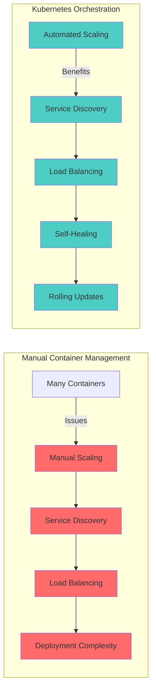
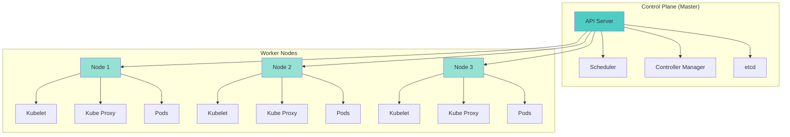
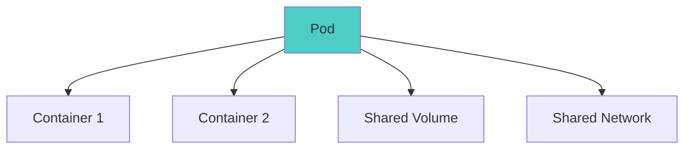
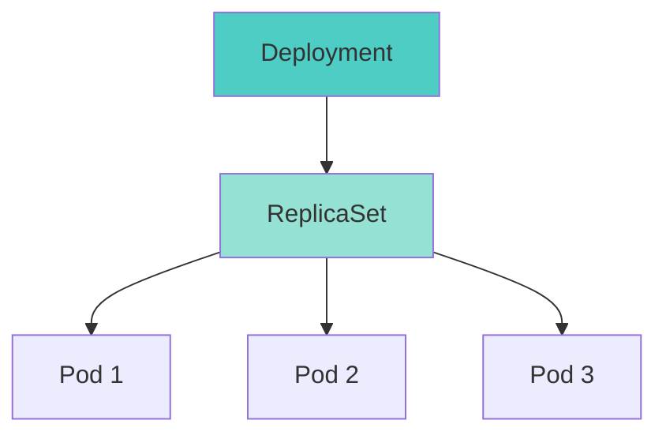
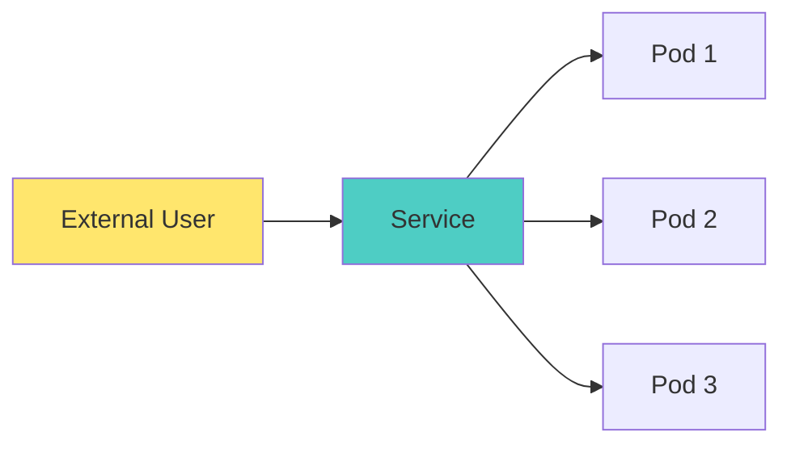
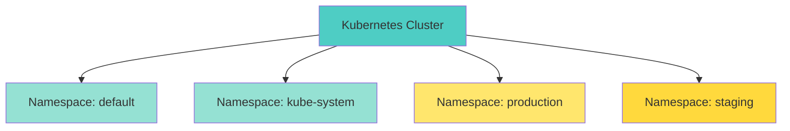

# ☸️ Kubernetes Fundamentals - Complete Guide

> "Kubernetes is the operating system of the cloud." - Kelsey Hightower

Kubernetes (K8s) is an open-source container orchestration platform that automates deployment, scaling, and management of containerized applications. This guide covers the fundamentals you need to get started with Kubernetes.

---

## 🎯 What is Kubernetes?

**Kubernetes** is a portable, extensible, open-source platform for managing containerized workloads and services. It helps you deploy, scale, and manage applications in a distributed system.

### Why Kubernetes?



**Key Benefits:**
- ✅ **Automated Scaling**: Scale applications up or down
- ✅ **Self-Healing**: Replace failed containers automatically
- ✅ **Service Discovery**: Automatically discover services
- ✅ **Load Balancing**: Distribute traffic across pods
- ✅ **Rolling Updates**: Update without downtime

---

## 🏗️ Kubernetes Architecture

### Cluster Architecture



### Control Plane Components

1. **API Server**: Entry point for all REST commands
2. **Scheduler**: Assigns pods to nodes
3. **Controller Manager**: Runs controllers that manage cluster state
4. **etcd**: Key-value store for cluster state

### Worker Node Components

1. **Kubelet**: Agent that communicates with control plane
2. **Kube Proxy**: Network proxy managing service endpoints
3. **Container Runtime**: Docker, containerd, or CRI-O

---

## 📦 Core Kubernetes Concepts

### 1. Pods

**Pods** are the smallest deployable units in Kubernetes. A pod contains one or more containers.



**Pod Example:**
```yaml
apiVersion: v1
kind: Pod
metadata:
  name: nginx-pod
spec:
  containers:
  - name: nginx
    image: nginx:latest
    ports:
    - containerPort: 80
```

### 2. Deployments

**Deployments** manage ReplicaSets and provide declarative updates to Pods.



**Deployment Example:**
```yaml
apiVersion: apps/v1
kind: Deployment
metadata:
  name: nginx-deployment
spec:
  replicas: 3
  selector:
    matchLabels:
      app: nginx
  template:
    metadata:
      labels:
        app: nginx
    spec:
      containers:
      - name: nginx
        image: nginx:1.21
        ports:
        - containerPort: 80
```

### 3. Services

**Services** expose applications running on Pods to other Pods or external users.



**Service Types:**
- **ClusterIP**: Internal service (default)
- **NodePort**: Exposes service on each node's IP
- **LoadBalancer**: Exposes service externally via cloud provider
- **ExternalName**: Maps service to external DNS name

**Service Example:**
```yaml
apiVersion: v1
kind: Service
metadata:
  name: nginx-service
spec:
  selector:
    app: nginx
  ports:
  - protocol: TCP
    port: 80
    targetPort: 80
  type: LoadBalancer
```

### 4. Namespaces

**Namespaces** provide logical isolation within a cluster.



**Namespaces Example:**
```yaml
apiVersion: v1
kind: Namespace
metadata:
  name: production
```

---

## 🚀 Essential kubectl Commands

### Basic Operations

```bash
# View cluster information
kubectl cluster-info

# Get nodes
kubectl get nodes

# Get pods
kubectl get pods
kubectl get pods -A  # All namespaces

# Get deployments
kubectl get deployments

# Get services
kubectl get services

# Describe a resource
kubectl describe pod <pod-name>

# Get logs
kubectl logs <pod-name>
kubectl logs -f <pod-name>  # Follow logs

# Execute command in pod
kubectl exec -it <pod-name> -- bash
```

### Create Resources

```bash
# Create from YAML file
kubectl apply -f deployment.yaml

# Create from URL
kubectl apply -f https://example.com/deployment.yaml

# Create from stdin
cat deployment.yaml | kubectl apply -f -
```

### Delete Resources

```bash
# Delete from YAML file
kubectl delete -f deployment.yaml

# Delete by name
kubectl delete pod <pod-name>
kubectl delete deployment <deployment-name>

# Delete all in namespace
kubectl delete all --all -n <namespace>
```

### Update Resources

```bash
# Edit resource
kubectl edit deployment <deployment-name>

# Scale deployment
kubectl scale deployment <deployment-name> --replicas=5

# Rolling update
kubectl set image deployment/<deployment-name> nginx=nginx:1.22

# Rollout status
kubectl rollout status deployment/<deployment-name>

# Rollback
kubectl rollout undo deployment/<deployment-name>
```

---

## 📝 YAML Configuration Files

### Common YAML Structure

```yaml
apiVersion: apps/v1        # API version
kind: Deployment           # Resource type
metadata:                  # Metadata
  name: my-app
  namespace: default
  labels:
    app: my-app
spec:                      # Specification
  replicas: 3
  selector:
    matchLabels:
      app: my-app
  template:                # Pod template
    metadata:
      labels:
        app: my-app
    spec:
      containers:
      - name: my-app
        image: my-app:1.0
        ports:
        - containerPort: 8080
```

### Important Fields

| Field | Description | Example |
|-------|-------------|---------|
| `apiVersion` | API version | `v1`, `apps/v1` |
| `kind` | Resource type | `Pod`, `Deployment`, `Service` |
| `metadata` | Resource metadata | Name, labels, namespace |
| `spec` | Desired state | Replicas, containers, etc. |
| `status` | Current state | (Read-only, set by Kubernetes) |

---

## 🎯 Kubernetes Best Practices

### 1. Resource Management

```yaml
# ✅ Good: Define resource requests and limits
spec:
  containers:
  - name: nginx
    resources:
      requests:
        memory: "128Mi"
        cpu: "100m"
      limits:
        memory: "256Mi"
        cpu: "200m"
```

### 2. Health Checks

```yaml
# ✅ Good: Use health checks
spec:
  containers:
  - name: nginx
    livenessProbe:
      httpGet:
        path: /
        port: 80
      initialDelaySeconds: 30
      periodSeconds: 10
    readinessProbe:
      httpGet:
        path: /
        port: 80
      initialDelaySeconds: 5
      periodSeconds: 5
```

### 3. Labels and Selectors

```yaml
# ✅ Good: Use meaningful labels
metadata:
  labels:
    app: nginx
    version: 1.21
    environment: production
```

### 4. Namespaces

```yaml
# ✅ Good: Use namespaces for isolation
# Separate environments, teams, or projects
```

---

## 📚 Next Steps

Now that you understand Kubernetes fundamentals:

1. **Practice**: Deploy your first application to Kubernetes
2. **Learn Advanced Kubernetes** → [Kubernetes Advanced Topics](./kubernetes-advanced.md)
3. **Study Production Patterns** → [Production Kubernetes Patterns](./kubernetes-production.md)
4. **Learn Deployment Flow** → [Kubernetes Deployment Flow](../kubernetes_deployment_flow.md)

---

## 🎓 Key Takeaways

- ✅ Kubernetes orchestrates containerized applications
- ✅ Pods are the smallest deployable units
- ✅ Deployments manage ReplicaSets and Pods
- ✅ Services expose applications internally and externally
- ✅ Namespaces provide logical isolation
- ✅ kubectl is the CLI tool for interacting with Kubernetes

---

## 📖 Additional Resources

- **Official Documentation**: [kubernetes.io/docs](https://kubernetes.io/docs)
- **kubectl Reference**: [kubernetes.io/docs/reference/kubectl](https://kubernetes.io/docs/reference/kubectl)
- **Interactive Tutorial**: [kubernetes.io/docs/tutorials](https://kubernetes.io/docs/tutorials)

---

**Author**: Chinmaya Jena  
**Last Updated**: January 2025  
**Version**: 1.0

