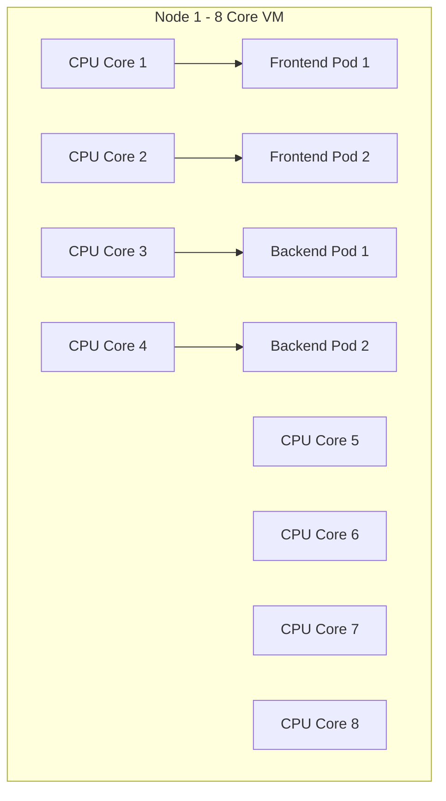
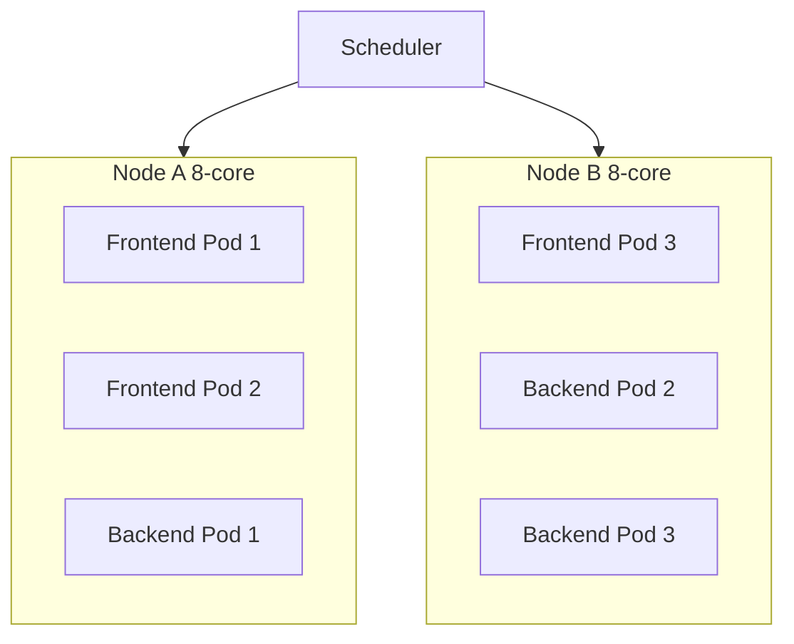
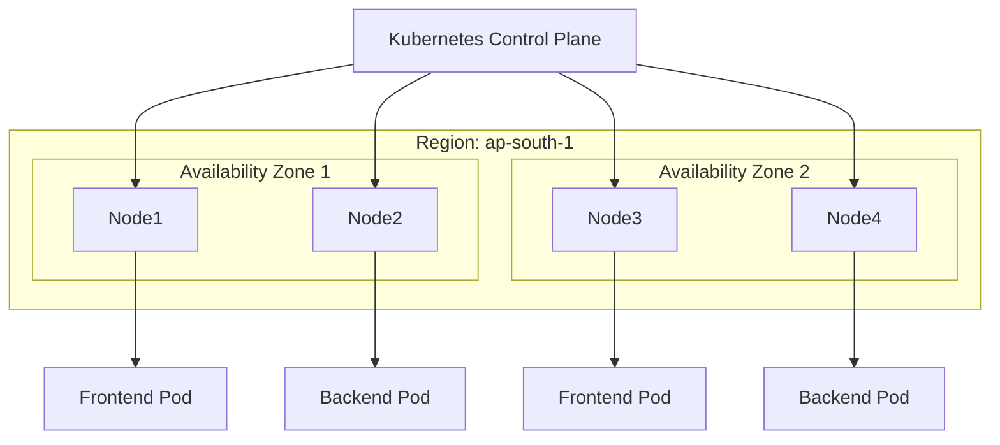
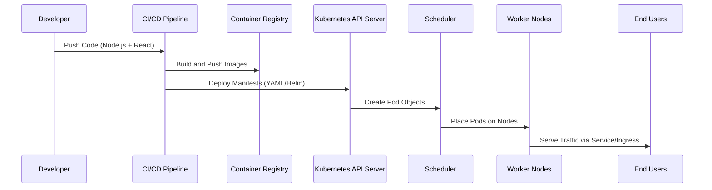
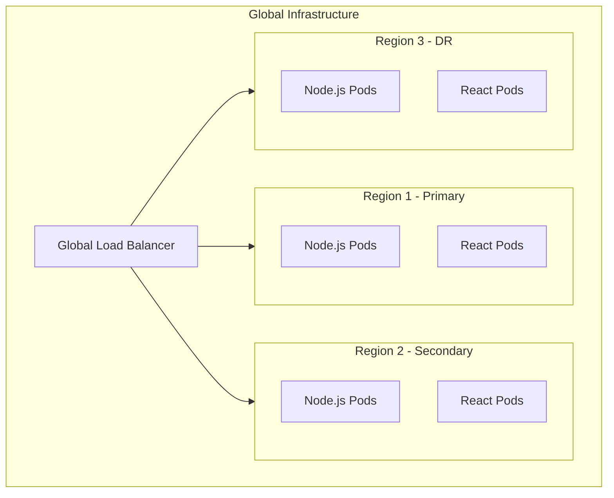

# 🚀 Kubernetes Application Deployment Flow (Node.js + React)

This document visually explains how **Kubernetes** deploys and scales a full-stack application across **nodes, regions, and availability domains**, using clear **Mermaid diagrams**.

---

## 🧩 1. Node, Pods, and CPU Utilization

Kubernetes nodes are **multi-core machines** (e.g., 8-core EC2 instances).  
Each core can run multiple **container threads**, but Kubernetes schedules **Pods** based on CPU *requests and limits* — not strictly one pod per core.



### 🔍 Explanation:
- Kubernetes **scheduler** places pods based on CPU and memory **requests**.  
- Each pod can use **fractions of a CPU** (e.g., 0.25, 0.5 core).  
- An 8-core node can run multiple pods (e.g., 16 pods each requesting 0.5 CPU).  
- **Full CPU utilization** happens when the sum of requests matches allocatable cores.

---

## ⚙️ 2. Pod Placement Across Nodes (2 instances)

When you deploy, Kubernetes spreads Pods **evenly** across nodes for balance and redundancy.



### 📘 Scheduling Factors:
- **CPU & Memory Requests** — Pods are placed only where resources are available.  
- **Node Selector / Affinity** — Controls placement rules (e.g., frontends and backends on separate nodes).  
- **Pod Anti-Affinity** — Ensures replicas don't end up on the same node (for HA).  

---

## ☁️ 3. Single-Region (Multi-AZ / Availability Domain) Deployment

In production, a region often contains **multiple availability zones (AZs)** for high availability.



### 💡 How scaling works here:
- **Horizontal Pod Autoscaler (HPA)** increases Pods when CPU/memory thresholds exceed targets.  
- **Cluster Autoscaler (CA)** adds more Nodes when Pods are unschedulable.  
- Pods get distributed across **AZs** to ensure resilience during zone failures.

---

## 🌍 4. Multi-Region Architecture (One Master Region)

When serving global traffic, we use multiple clusters — each in a region — with one **Primary (Master)** region controlling configuration.

```mermaid
graph LR
    subgraph RegionA[Primary Region - Control & Deployment]
        CP[Control Plane (Master)]
        NodeA1[Frontend Pods]
        NodeA2[Backend Pods]
    end

    subgraph RegionB[Secondary Region]
        NodeB1[Frontend Pods]
        NodeB2[Backend Pods]
    end

    subgraph RegionC[Disaster Recovery Region]
        NodeC1[Frontend Pods]
        NodeC2[Backend Pods]
    end

    User[Global Users] --> GLB[Global Load Balancer DNS/Geo Routing]
    GLB --> LB_A[Regional LB - RegionA]
    GLB --> LB_B[Regional LB - RegionB]
    GLB --> LB_C[Regional LB - RegionC]
    LB_A --> NodeA1
    LB_A --> NodeA2
    LB_B --> NodeB1
    LB_B --> NodeB2
    LB_C --> NodeC1
    LB_C --> NodeC2
    CP --> NodeA1
    CP --> NodeA2
```

### 🌐 Explanation:
- **Master region (Region A)** hosts the main Control Plane — it manages deployments via GitOps (e.g., ArgoCD).  
- Other regions (B, C) sync configs and run independently if the master fails.  
- **Global Load Balancer** directs users to the nearest healthy region.  
- Data synchronization via **multi-region database replication**.

---

## 🔁 5. Full End-to-End Flow: From Git Push to Running App



### 🧠 What happens under the hood:
1. **CI builds Docker images** and pushes them to a registry.  
2. **CD applies manifests** to Kubernetes (deployments, services, ingress).  
3. The **API Server** records desired state; **Scheduler** finds nodes with available resources.  
4. **Kubelet** runs containers; **Service** routes traffic internally.  
5. **Ingress / LoadBalancer** exposes the app externally.

---

## 📈 6. Scaling Across Regions and Domains (Summary View)



### 🚀 Summary:
- **Within a Node:** Pods share CPU cores proportionally.  
- **Within a Region:** Autoscalers balance pods across nodes & AZs.  
- **Across Regions:** Global Load Balancer + multi-region clusters ensure high availability.  
- **Master region** handles deployment orchestration and global configuration sync.

---

**Author:** Chinmaya — Cloud & DevOps Engineer  
**Version:** 2.0  
**License:** MIT

