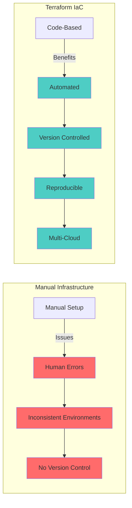
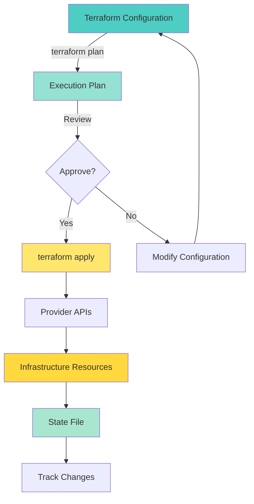
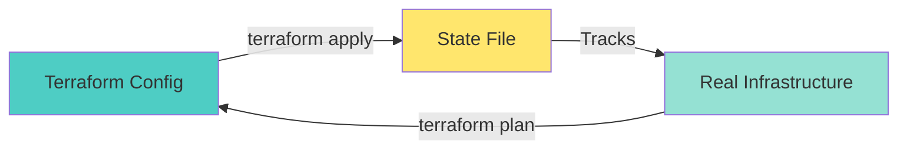
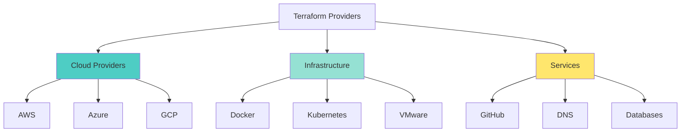

# 🏗️ Terraform Fundamentals - Complete Guide

> "Write, Plan, and Create Infrastructure as Code" - HashiCorp

Terraform is an Infrastructure as Code (IaC) tool that enables you to safely and predictably create, change, and improve infrastructure using declarative configuration files.

---

## 🎯 What is Terraform?

**Terraform** is an open-source infrastructure as code tool that lets you define and provision infrastructure resources using a high-level configuration language.

### Why Terraform?



**Key Benefits:**
- ✅ **Infrastructure as Code**: Version control for infrastructure
- ✅ **Multi-Cloud**: Works with AWS, Azure, GCP, and 100+ providers
- ✅ **Declarative**: Describe desired state
- ✅ **Idempotent**: Safe to run multiple times
- ✅ **State Management**: Tracks resource state

---

## 🏗️ Terraform Architecture

### Core Concepts



### Terraform Workflow

1. **Write**: Define infrastructure in `.tf` files
2. **Initialize**: `terraform init` - Download providers
3. **Plan**: `terraform plan` - Preview changes
4. **Apply**: `terraform apply` - Create infrastructure
5. **Destroy**: `terraform destroy` - Remove infrastructure

---

## 📝 Basic Terraform Syntax

### Simple Example

```hcl
# Configure the AWS Provider
terraform {
  required_providers {
    aws = {
      source  = "hashicorp/aws"
      version = "~> 5.0"
    }
  }
}

# Configure AWS Provider
provider "aws" {
  region = "us-east-1"
}

# Create an EC2 instance
resource "aws_instance" "web" {
  ami           = "ami-0c55b159cbfafe1f0"
  instance_type = "t2.micro"
  
  tags = {
    Name = "WebServer"
  }
}
```

### Core Components

1. **Terraform Block**: Version and provider requirements
2. **Provider Block**: Configure cloud provider
3. **Resource Block**: Define infrastructure resources
4. **Variables**: Input parameters
5. **Outputs**: Return values

---

## 🚀 Essential Terraform Commands

### Initialization & Planning

```bash
# Initialize Terraform
terraform init

# Validate configuration
terraform validate

# Format configuration files
terraform fmt

# Plan changes
terraform plan

# Apply changes
terraform apply

# Apply with auto-approve
terraform apply -auto-approve

# Show current state
terraform show

# Destroy infrastructure
terraform destroy
```

### State Management

```bash
# List resources in state
terraform state list

# Show specific resource
terraform state show aws_instance.web

# Remove resource from state (not destroy)
terraform state rm aws_instance.web

# Import existing resource
terraform import aws_instance.web i-1234567890abcdef0
```

---

## 📦 Terraform Configuration Files

### File Structure

```
project/
├── main.tf          # Main configuration
├── variables.tf     # Input variables
├── outputs.tf       # Output values
├── terraform.tfvars # Variable values
└── versions.tf      # Provider versions
```

### Main Configuration (main.tf)

```hcl
terraform {
  required_version = ">= 1.0"
  
  required_providers {
    aws = {
      source  = "hashicorp/aws"
      version = "~> 5.0"
    }
  }
}

provider "aws" {
  region = var.aws_region
}

resource "aws_instance" "web" {
  ami           = var.ami_id
  instance_type = var.instance_type
  
  tags = {
    Name = var.instance_name
  }
}
```

### Variables (variables.tf)

```hcl
variable "aws_region" {
  description = "AWS region"
  type        = string
  default     = "us-east-1"
}

variable "ami_id" {
  description = "AMI ID for EC2 instance"
  type        = string
}

variable "instance_type" {
  description = "EC2 instance type"
  type        = string
  default     = "t2.micro"
}

variable "instance_name" {
  description = "Name tag for instance"
  type        = string
}
```

### Outputs (outputs.tf)

```hcl
output "instance_id" {
  description = "ID of the EC2 instance"
  value       = aws_instance.web.id
}

output "instance_public_ip" {
  description = "Public IP of the EC2 instance"
  value       = aws_instance.web.public_ip
}
```

### Variable Values (terraform.tfvars)

```hcl
aws_region    = "us-east-1"
ami_id        = "ami-0c55b159cbfafe1f0"
instance_type = "t2.micro"
instance_name = "WebServer"
```

---

## 🎯 Terraform State

### What is State?

State is a file that tracks the mapping between Terraform configuration and real-world resources.



### State Management Best Practices

1. **Use Remote State**
   ```hcl
   terraform {
     backend "s3" {
       bucket = "my-terraform-state"
       key    = "terraform.tfstate"
       region = "us-east-1"
     }
   }
   ```

2. **State Locking**
   - Prevents concurrent modifications
   - Automatic with remote backends

3. **State Security**
   - Store state in secure location
   - Enable encryption at rest
   - Use access controls

---

## 🏗️ Terraform Modules

### What are Modules?

Modules are reusable configurations that encapsulate infrastructure components.

### Module Structure

```
modules/
└── ec2-instance/
    ├── main.tf
    ├── variables.tf
    ├── outputs.tf
    └── README.md
```

### Using Modules

```hcl
module "web_server" {
  source = "./modules/ec2-instance"
  
  ami_id        = "ami-0c55b159cbfafe1f0"
  instance_type = "t2.micro"
  instance_name = "WebServer"
}
```

### Module Registry

Use modules from Terraform Registry:
```hcl
module "vpc" {
  source = "terraform-aws-modules/vpc/aws"
  
  name = "my-vpc"
  cidr = "10.0.0.0/16"
  
  azs             = ["us-east-1a", "us-east-1b"]
  private_subnets = ["10.0.1.0/24", "10.0.2.0/24"]
  public_subnets  = ["10.0.101.0/24", "10.0.102.0/24"]
}
```

---

## 🌐 Terraform Providers

### Popular Providers



### Provider Configuration

```hcl
# AWS Provider
provider "aws" {
  region = "us-east-1"
  
  # Credentials via environment variables or AWS config
  # AWS_ACCESS_KEY_ID
  # AWS_SECRET_ACCESS_KEY
}

# Azure Provider
provider "azurerm" {
  features {}
  
  # Credentials via Azure CLI or Service Principal
}

# GCP Provider
provider "google" {
  project = "my-project"
  region  = "us-central1"
  
  # Credentials via service account
}
```

---

## 📊 Terraform Best Practices

### 1. File Organization

```
project/
├── environments/
│   ├── dev/
│   │   ├── main.tf
│   │   └── terraform.tfvars
│   ├── staging/
│   │   ├── main.tf
│   │   └── terraform.tfvars
│   └── prod/
│       ├── main.tf
│       └── terraform.tfvars
├── modules/
│   └── ...
└── README.md
```

### 2. Version Control

```hcl
# Always pin provider versions
terraform {
  required_providers {
    aws = {
      source  = "hashicorp/aws"
      version = "~> 5.0"  # Use version constraints
    }
  }
}
```

### 3. Variable Validation

```hcl
variable "instance_type" {
  description = "EC2 instance type"
  type        = string
  
  validation {
    condition     = contains(["t2.micro", "t2.small", "t3.medium"], var.instance_type)
    error_message = "Instance type must be one of: t2.micro, t2.small, t3.medium"
  }
}
```

### 4. Use Outputs

```hcl
# Expose important values
output "endpoint" {
  description = "Application endpoint"
  value       = "https://${aws_lb.web.dns_name}"
  sensitive   = false
}
```

### 5. Remote State

```hcl
# Always use remote state for production
terraform {
  backend "s3" {
    bucket         = "my-terraform-state"
    key            = "prod/terraform.tfstate"
    region         = "us-east-1"
    encrypt        = true
    dynamodb_table = "terraform-state-lock"
  }
}
```

---

## 🚨 Common Terraform Issues

### 1. State Lock Errors

```bash
# Error: Error acquiring the state lock
# Solution: Unlock state (if safe)
terraform force-unlock <LOCK_ID>
```

### 2. Resource Drift

```bash
# Detect drift
terraform plan

# Refresh state
terraform refresh

# Import missing resources
terraform import <resource_type>.<name> <resource_id>
```

### 3. Provider Version Conflicts

```bash
# Error: Provider version conflict
# Solution: Update provider versions
terraform init -upgrade
```

---

## 📚 Next Steps

Now that you understand Terraform fundamentals:

1. **Practice**: Create your first Terraform configuration
2. **Learn Advanced Terraform** → [Terraform Advanced Patterns](./terraform-advanced.md)
3. **Study Modules**: Create reusable modules
4. **Learn Ansible** → [Ansible Fundamentals](../ansible/ansible-fundamentals.md)

---

## 🎓 Key Takeaways

- ✅ Terraform is Infrastructure as Code tool
- ✅ Declarative syntax defines desired state
- ✅ State file tracks real-world resources
- ✅ Modules enable code reuse
- ✅ Remote state for team collaboration
- ✅ Supports 100+ providers

---

## 📖 Additional Resources

- **Official Documentation**: [terraform.io/docs](https://www.terraform.io/docs)
- **Terraform Registry**: [registry.terraform.io](https://registry.terraform.io)
- **HashiCorp Learn**: [learn.hashicorp.com/terraform](https://learn.hashicorp.com/terraform)

---

**Author**: Chinmaya Jena  
**Last Updated**: January 2025  
**Version**: 1.0

