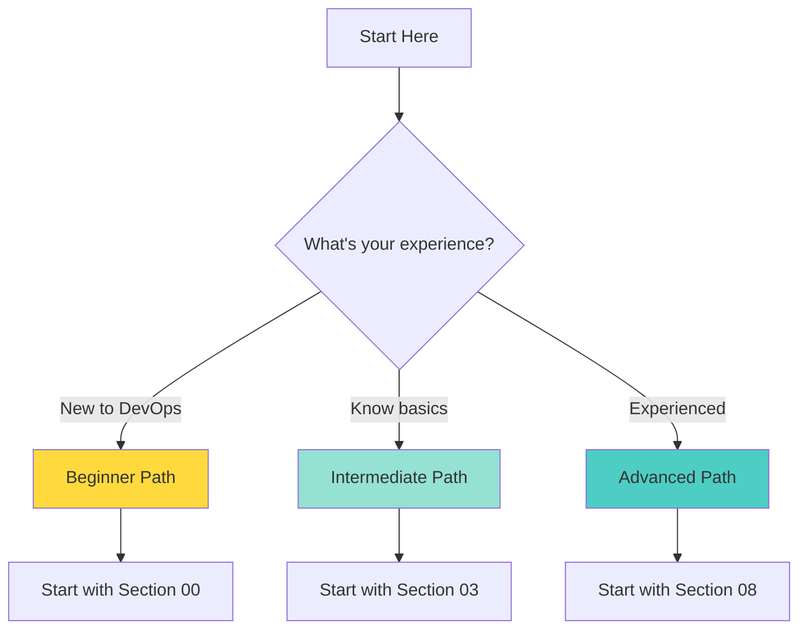

# ⚡ Quick Start Guide - DevOps Handbook

Welcome to the DevOps Handbook! This quick start guide will help you navigate through the comprehensive learning path.

---

## 🚀 Getting Started in 5 Minutes

### Step 1: Assess Your Level

**Choose your path:**
- 🌱 **Beginner**: Start with [00 - Getting Started](./00-getting-started/introduction-to-devops.md)
- 📚 **Intermediate**: Start with [03 - Containerization](./03-containerization/docker/docker-fundamentals.md)
- 🏗️ **Advanced**: Start with [08 - DevSecOps](./08-devsecops/devsecops-introduction.md)

---

## 📖 Recommended Learning Path

### Week 1: Foundation (16-20 hours)

1. ✅ [Introduction to DevOps](./00-getting-started/introduction-to-devops.md) - 2 hours
2. ✅ [Prerequisites & Setup](./00-getting-started/prerequisites.md) - 2 hours
3. ✅ [Git Fundamentals](./01-version-control/git-fundamentals.md) - 6 hours
4. ✅ [Linux Basics](./02-linux-fundamentals/linux-basics.md) - 6 hours

**Outcome**: Master version control and Linux fundamentals

---

### Week 2-3: Core Tools (20-30 hours)

1. ✅ [Docker Fundamentals](./03-containerization/docker/docker-fundamentals.md) - 12 hours
2. ✅ [CI/CD Concepts](./05-ci-cd/cicd-concepts.md) - 4 hours
3. ✅ [Terraform Fundamentals](./06-infrastructure-as-code/terraform/terraform-fundamentals.md) - 8 hours

**Outcome**: Build, deploy, and manage infrastructure with code

---

### Week 4-6: Orchestration (30-40 hours)

1. ✅ [Kubernetes Fundamentals](./04-container-orchestration/kubernetes/kubernetes-fundamentals.md) - 16 hours
2. ✅ [Kubernetes Advanced](./04-container-orchestration/kubernetes/kubernetes-advanced.md) - 12 hours
3. ✅ [Jenkins Complete Guide](./05-ci-cd/jenkins/jenkins-complete-guide.md) - 8 hours

**Outcome**: Orchestrate containers and automate deployments

---

### Week 7-8: Advanced Topics (25-30 hours)

1. ✅ [Monitoring Concepts](./07-monitoring-logging/monitoring-concepts.md) - 4 hours
2. ✅ [Prometheus Guide](./07-monitoring-logging/prometheus/prometheus-guide.md) - 8 hours
3. ✅ [DevSecOps Introduction](./08-devsecops/devsecops-introduction.md) - 6 hours
4. ✅ [Best Practices](./10-best-practices/production-best-practices.md) - 8 hours

**Outcome**: Monitor systems and secure your pipelines

---

## 🎯 Learning Objectives by Section

### 00. Getting Started ✅
- Understand DevOps culture and principles
- Set up development environment
- Plan your learning journey

### 01. Version Control (Git) ✅
- Master Git commands
- Understand branching strategies
- Collaborate effectively

### 02. Linux Fundamentals ✅
- Navigate Linux file system
- Manage processes and services
- Write shell scripts

### 03. Containerization (Docker) ✅
- Build Docker images
- Run and manage containers
- Use Docker Compose

### 04. Container Orchestration (Kubernetes) ✅
- Deploy applications to Kubernetes
- Manage pods and services
- Scale applications

### 05. CI/CD Pipelines ✅
- Build automated pipelines
- Deploy applications automatically
- Implement deployment strategies

### 06. Infrastructure as Code ✅
- Provision infrastructure with Terraform
- Manage configurations with Ansible
- Version control infrastructure

### 07. Monitoring & Logging ✅
- Set up Prometheus and Grafana
- Implement ELK stack
- Monitor applications effectively

### 08. DevSecOps ✅
- Integrate security into CI/CD
- Scan for vulnerabilities
- Manage secrets securely

### 09. Cloud Platforms ✅
- Deploy to AWS, Azure, GCP
- Understand multi-cloud strategies
- Optimize cloud costs

### 10. Best Practices ✅
- Follow enterprise patterns
- Implement production best practices
- Learn from real-world case studies

---

## 📚 Essential Resources

### Documentation Links
- [Docker Docs](https://docs.docker.com)
- [Kubernetes Docs](https://kubernetes.io/docs)
- [Terraform Docs](https://www.terraform.io/docs)
- [Jenkins Docs](https://www.jenkins.io/doc)

### Practice Platforms
- [KodeKloud](https://kodekloud.com) - Hands-on labs
- [Kubernetes Playground](https://www.katacoda.com) - Interactive tutorials
- [Docker Playground](https://labs.play-with-docker.com) - Practice Docker

---

## ✅ Progress Checklist

Track your progress through the handbook:

### Foundation ✅
- [ ] Read Introduction to DevOps
- [ ] Complete prerequisites setup
- [ ] Master Git fundamentals
- [ ] Learn Linux basics

### Core Tools ✅
- [ ] Docker fundamentals
- [ ] CI/CD concepts
- [ ] Terraform basics

### Orchestration ✅
- [ ] Kubernetes fundamentals
- [ ] Deploy first application
- [ ] Set up CI/CD pipeline

### Advanced ✅
- [ ] Monitoring stack setup
- [ ] Security integration
- [ ] Cloud deployment

---

## 🎓 Certification Path

After completing this handbook, you'll be ready for:

1. **Docker Certified Associate (DCA)**
2. **Certified Kubernetes Administrator (CKA)**
3. **Certified Kubernetes Application Developer (CKAD)**
4. **AWS Certified DevOps Engineer**
5. **HashiCorp Certified: Terraform Associate**

---

## 💡 Tips for Success

1. **Practice Regularly**: Spend 1-2 hours daily
2. **Build Projects**: Apply concepts in real projects
3. **Join Communities**: Learn from others
4. **Stay Updated**: DevOps evolves rapidly
5. **Take Notes**: Document your learnings

---

## 🚀 Ready to Start?

Begin your DevOps journey now:

1. **New to DevOps?** → Start with [Introduction to DevOps](./00-getting-started/introduction-to-devops.md)
2. **Know the basics?** → Jump to [Docker Fundamentals](./03-containerization/docker/docker-fundamentals.md)
3. **Ready for advanced?** → Explore [DevSecOps](./08-devsecops/devsecops-introduction.md)

---

**Remember**: DevOps is a journey, not a destination. Keep learning, practicing, and improving!

---

**Author**: Chinmaya Jena  
**Last Updated**: January 2025  
**Version**: 1.0

