# 🚀 DevOps Handbook - Complete Guide from Zero to Hero

> A comprehensive, enterprise-focused DevOps knowledge base showcasing tools, workflows, and best practices used by top engineering teams worldwide.  
> This repository explains complex DevOps concepts **visually, practically, and simply**, yet with the depth expected in real production environments.

---

## 🎯 Purpose of This Repository

This handbook is designed to:
- **Guide beginners** from foundational concepts to advanced DevOps practices
- **Showcase expertise** in enterprise-grade DevOps tooling and methodologies
- **Provide visual explanations** with diagrams and architecture patterns
- **Share best practices** learned from real-world production deployments
- **Serve as a portfolio** demonstrating comprehensive DevOps knowledge

Whether you're starting your DevOps journey or preparing for senior roles, this handbook covers everything from basic concepts to advanced enterprise patterns.

---

## 🗺️ Learning Path: From Zero to Hero

This handbook follows a structured learning path designed to build your DevOps expertise progressively:

```mermaid
graph TD
    A[🌱 Beginner: Foundation] --> B[📚 Intermediate: Core Tools]
    B --> C[🏗️ Advanced: Orchestration]
    C --> D[🚀 Expert: Enterprise Patterns]
    
    A --> A1[00: Getting Started]
    A --> A2[01: Version Control - Git]
    A --> A3[02: Linux Fundamentals]
    
    B --> B1[03: Containerization - Docker]
    B --> B2[05: CI/CD Pipelines]
    B --> B3[06: Infrastructure as Code]
    
    C --> C1[04: Kubernetes Orchestration]
    C --> C2[07: Monitoring & Logging]
    
    D --> D1[08: DevSecOps]
    D --> D2[09: Cloud Platforms]
    D --> D3[10: Best Practices]
```

### 📖 Learning Stages

#### 🌱 **Stage 0-2: Foundation (Beginner)**
- Understanding DevOps culture and principles
- Mastering Git and version control
- Linux fundamentals and shell scripting

#### 📚 **Stage 3-6: Core Tools (Intermediate)**
- Docker containerization
- CI/CD pipeline development
- Infrastructure as Code (Terraform, Ansible)
- Basic Kubernetes concepts

#### 🏗️ **Stage 4 & 7: Orchestration (Advanced)**
- Kubernetes cluster management
- Advanced deployment strategies
- Monitoring and observability
- Service mesh implementations

#### 🚀 **Stage 8-10: Enterprise (Expert)**
- DevSecOps integration
- Multi-cloud strategies
- Enterprise architecture patterns
- Production-grade best practices

---

## 📚 Complete Curriculum

### 00. Getting Started
- [Introduction to DevOps](./00-getting-started/introduction-to-devops.md)
- [Learning Path & Roadmap](./00-getting-started/learning-path.md)
- [Prerequisites & Setup](./00-getting-started/prerequisites.md)

### 01. Version Control (Git)
- [Git Fundamentals](./01-version-control/git-fundamentals.md)
- [Advanced Git Techniques](./01-version-control/git-advanced.md)
- [Branching Strategies](./01-version-control/branching-strategies.md)

### 02. Linux Fundamentals
- [Linux Basics for DevOps](./02-linux-fundamentals/linux-basics.md)
- [Shell Scripting](./02-linux-fundamentals/shell-scripting.md)
- [System Administration](./02-linux-fundamentals/system-administration.md)

### 03. Containerization (Docker)
- [Docker Fundamentals](./03-containerization/docker/docker-fundamentals.md)
- [Docker Advanced Concepts](./03-containerization/docker/docker-advanced.md)
- [Dockerfile Best Practices](./03-containerization/docker/dockerfile-best-practices.md)
- [Docker Compose Guide](./03-containerization/docker-compose/docker-compose-guide.md)

### 04. Container Orchestration (Kubernetes)
- [Kubernetes Fundamentals](./04-container-orchestration/kubernetes/kubernetes-fundamentals.md)
- [Kubernetes Deployment Flow](./04-container-orchestration/kubernetes/kubernetes_deployment_flow.md)
- [Kubernetes Advanced Topics](./04-container-orchestration/kubernetes/kubernetes-advanced.md)
- [Production Kubernetes Patterns](./04-container-orchestration/kubernetes/kubernetes-production.md)

### 05. CI/CD Pipelines
- [CI/CD Concepts](./05-ci-cd/cicd-concepts.md)
- [Jenkins Complete Guide](./05-ci-cd/jenkins/jenkins-complete-guide.md)
- [GitHub Actions](./05-ci-cd/github-actions/github-actions-guide.md)
- [GitLab CI/CD](./05-ci-cd/gitlab-ci/gitlab-ci-guide.md)
- [GitOps with ArgoCD](./05-ci-cd/gitops-argocd/gitops-guide.md)

### 06. Infrastructure as Code
- [Terraform Fundamentals](./06-infrastructure-as-code/terraform/terraform-fundamentals.md)
- [Terraform Advanced Patterns](./06-infrastructure-as-code/terraform/terraform-advanced.md)
- [Ansible Fundamentals](./06-infrastructure-as-code/ansible/ansible-fundamentals.md)
- [Ansible Advanced Techniques](./06-infrastructure-as-code/ansible/ansible-advanced.md)

### 07. Monitoring & Logging
- [Monitoring Concepts](./07-monitoring-logging/monitoring-concepts.md)
- [Prometheus Guide](./07-monitoring-logging/prometheus/prometheus-guide.md)
- [Grafana Dashboards](./07-monitoring-logging/grafana/grafana-guide.md)
- [ELK Stack Setup](./07-monitoring-logging/elk-stack/elk-stack-guide.md)

### 08. DevSecOps
- [DevSecOps Introduction](./08-devsecops/devsecops-introduction.md)
- [Security Scanning Tools](./08-devsecops/security-scanning-tools.md)
- [Secrets Management](./08-devsecops/secrets-management.md)
- [Container Security](./08-devsecops/container-security.md)

### 09. Cloud Platforms
- [Multi-Cloud Strategy](./09-cloud-platforms/multi-cloud-strategy.md)
- [AWS DevOps Services](./09-cloud-platforms/aws/aws-devops.md)
- [Azure DevOps](./09-cloud-platforms/azure/azure-devops.md)
- [GCP DevOps Tools](./09-cloud-platforms/gcp/gcp-devops.md)

### 10. Best Practices
- [Enterprise Architecture Patterns](./10-best-practices/architecture-patterns.md)
- [Production Best Practices](./10-best-practices/production-best-practices.md)
- [Troubleshooting Guide](./10-best-practices/troubleshooting-guide.md)
- [Real-World Case Studies](./10-best-practices/case-studies.md)

---

## 🏗️ Enterprise DevOps Architecture

```mermaid
flowchart TB
    subgraph "Development"
        Dev[👨‍💻 Developer] --> Git[📦 Git Repository]
    end
    
    subgraph "CI/CD Pipeline"
        Git --> CI[🔄 CI Pipeline]
        CI --> Build[🔨 Build & Test]
        Build --> Scan[🔍 Security Scan]
        Scan --> Registry[📦 Container Registry]
        Registry --> CD[🚀 CD Pipeline]
    end
    
    subgraph "Infrastructure"
        IaC[🏗️ Terraform/Ansible] --> Cloud[☁️ Cloud Infrastructure]
    end
    
    subgraph "Orchestration"
        CD --> K8s[☸️ Kubernetes Cluster]
        Cloud --> K8s
        K8s --> Mesh[🔀 Service Mesh]
    end
    
    subgraph "Applications"
        Mesh --> App1[📱 App Service 1]
        Mesh --> App2[📱 App Service 2]
        Mesh --> App3[📱 App Service 3]
    end
    
    subgraph "Observability"
        App1 --> Monitor[📊 Prometheus]
        App2 --> Monitor
        App3 --> Monitor
        App1 --> Logs[📝 ELK Stack]
        App2 --> Logs
        App3 --> Logs
        Monitor --> Grafana[📈 Grafana Dashboards]
    end
    
    subgraph "Security"
        Scan --> Vault[🔐 Vault]
        K8s --> Vault
        Vault --> Policies[🛡️ Security Policies]
    end
```

---

## 🧩 Tools & Technologies Covered

### Core Technologies
- ✅ **Git** - Version control and collaboration
- ✅ **Linux** - System administration and scripting
- ✅ **Docker** - Containerization platform
- ✅ **Kubernetes** - Container orchestration
- ✅ **Terraform** - Infrastructure as Code
- ✅ **Ansible** - Configuration management

### CI/CD Tools
- ✅ **Jenkins** - Automation server
- ✅ **GitHub Actions** - CI/CD workflows
- ✅ **GitLab CI/CD** - Integrated pipelines
- ✅ **ArgoCD** - GitOps continuous delivery

### Monitoring & Observability
- ✅ **Prometheus** - Metrics collection
- ✅ **Grafana** - Visualization dashboards
- ✅ **ELK Stack** - Log aggregation and analysis

### Security Tools
- ✅ **Trivy** - Container vulnerability scanning
- ✅ **Snyk** - Dependency scanning
- ✅ **Vault** - Secrets management
- ✅ **OWASP ZAP** - Security testing

### Cloud Platforms
- ✅ **AWS** - Amazon Web Services
- ✅ **Azure** - Microsoft Azure
- ✅ **GCP** - Google Cloud Platform

---

## 📊 Learning Statistics

- **Total Sections**: 10 major categories
- **Total Guides**: 40+ comprehensive guides
- **Diagrams**: 100+ visual explanations
- **Best Practices**: Enterprise-grade patterns
- **Real-World Examples**: Production-tested scenarios

---

## 🎓 How to Use This Handbook

1. **Start with the Basics**: Begin with [00-getting-started](./00-getting-started/introduction-to-devops.md)
2. **Follow the Path**: Progress through each numbered section sequentially
3. **Practice Hands-On**: Each section includes practical examples and exercises
4. **Review Diagrams**: Visual explanations help understand complex concepts
5. **Apply Best Practices**: Use the best practices section as a reference

---

## 🏆 Certification Path

This handbook prepares you for:
- **Docker Certified Associate (DCA)**
- **Certified Kubernetes Administrator (CKA)**
- **Certified Kubernetes Application Developer (CKAD)**
- **AWS Certified DevOps Engineer**
- **HashiCorp Certified: Terraform Associate**
- **Jenkins Certified Engineer**

---

## 🤝 Contributing

This is a personal knowledge repository showcasing DevOps expertise. Feel free to:
- Star this repository if you find it useful
- Fork and adapt for your own learning
- Share feedback and suggestions

---

## 👤 Author

**Chinmaya Jena**  
*Cloud, DevOps & Solutions Engineer*

Focused on automation, resilience, scalable architectures, and making complex concepts easy to understand.

**Connect:**
- 📧 Email: [Your Email]
- 💼 LinkedIn: [Your LinkedIn]
- 🐙 GitHub: [Your GitHub]

---

## 📜 License

This project is licensed under the MIT License - see the LICENSE file for details.

---

## ⭐ Support

If you find this project useful in your DevOps journey, consider giving it a **star** ⭐

---

**Last Updated**: January 2025  
**Version**: 2.0  
**Status**: 🚀 Actively Maintained

