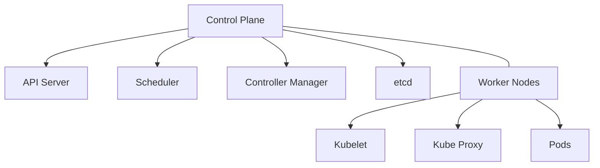
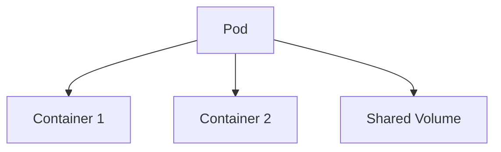
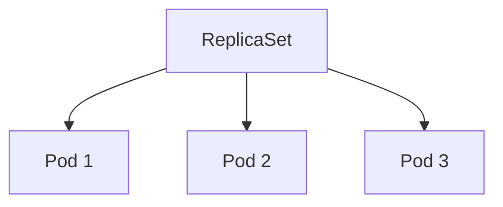
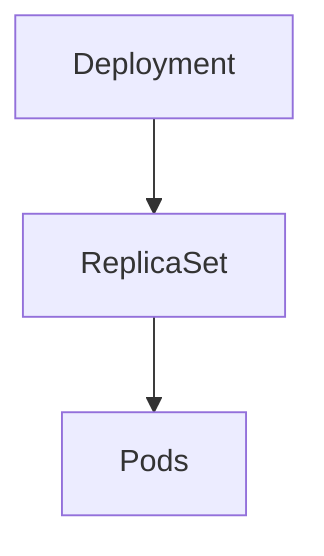
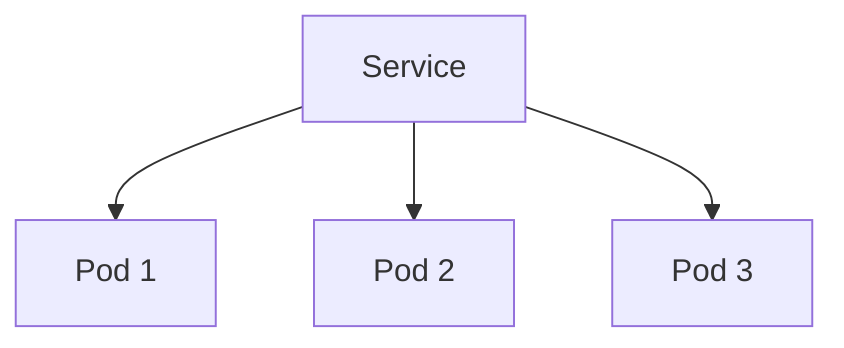
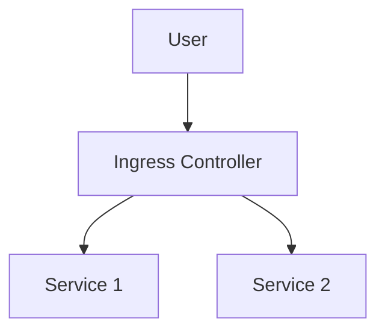
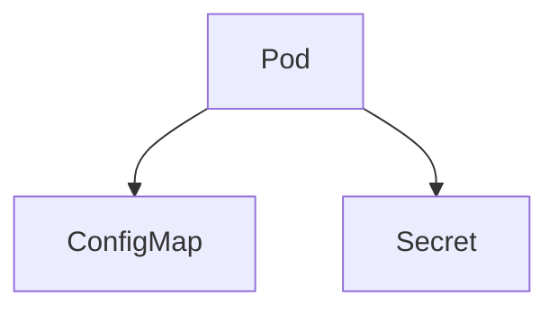
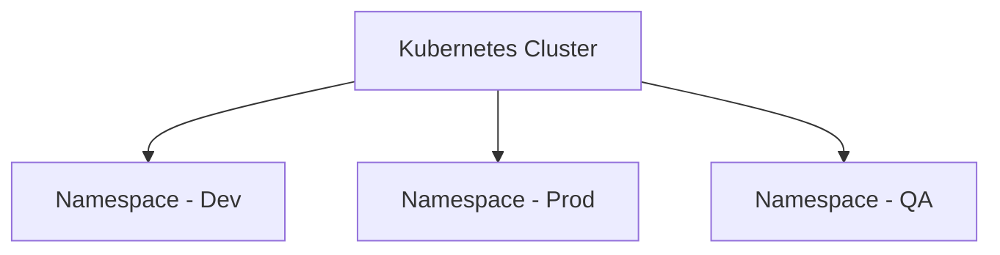
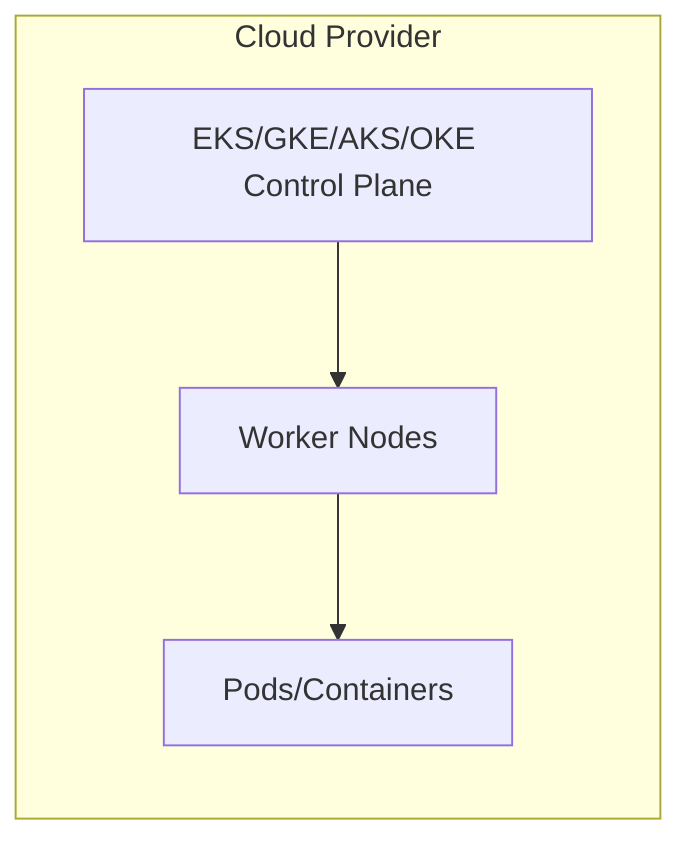
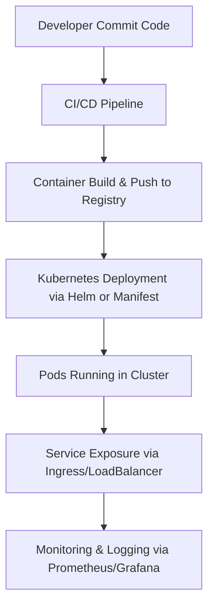

# Kubernetes - Complete Guide for DevOps & Cloud Engineers

## 🧭 Overview

Kubernetes (K8s) is an open-source **container orchestration platform** designed to automate the deployment, scaling, and management of containerized applications. It provides a robust infrastructure for running distributed systems resiliently.

---

## ⚙️ Core Components of Kubernetes

### 1. **Cluster Architecture**

A Kubernetes cluster consists of **Master Nodes (Control Plane)** and **Worker Nodes**.

**Explanation:**
- **Control Plane:** Manages the cluster and makes global decisions (e.g., scheduling).
- **Worker Nodes:** Execute containerized applications.
- **etcd:** Key-value store maintaining cluster state.
- **Kubelet:** Agent running on each node ensuring containers are healthy.
- **Kube Proxy:** Handles network communication inside and outside the cluster.

---

### 2. **Pods**

Pods are the **smallest deployable units** in Kubernetes. A Pod can contain one or more containers that share storage, networking, and specifications.

**Key Points:**
- All containers in a pod share the same **network namespace**.
- Pods are **ephemeral** — if one fails, Kubernetes replaces it automatically.

---

### 3. **ReplicaSet**

Ensures a **specified number of pod replicas** are running at any time.

**Purpose:**
- Maintains pod availability.
- Used by **Deployments** for scaling and rollback operations.

---

### 4. **Deployment**

A **Deployment** provides declarative updates for Pods and ReplicaSets.

**Features:**
- Rollouts and rollbacks.
- Self-healing mechanism.
- Easy scaling with one command.

---

### 5. **Service**

A **Service** exposes applications running on Pods to other Pods or external users.

**Types:**
- ClusterIP: Internal communication.
- NodePort: Exposes via each node’s IP.
- LoadBalancer: Exposes externally via cloud provider.

---

### 6. **Ingress**

Manages **external HTTP/HTTPS access** to services in a cluster.

**Used For:**
- Centralized routing and SSL termination.
- Acts as API gateway.

---

### 7. **ConfigMap & Secret**

- **ConfigMap:** Manages non-confidential data (e.g., environment variables).
- **Secret:** Stores confidential data (e.g., passwords, tokens).

---

### 8. **Namespaces**

Logical isolation mechanism for grouping resources within a cluster.

**Advantages:**
- Multi-tenancy.
- Access control & resource quotas.

---

## ☁️ Kubernetes in Cloud (Managed Kubernetes)

Cloud providers offer **Managed Kubernetes Services**:
- **Amazon EKS (AWS)**
- **Azure AKS (Azure)**
- **Google GKE (GCP)**
- **Oracle OKE (OCI)**

These manage the control plane, scaling, and upgrades automatically.

### **Production Deployment Workflow**

**Highlights:**
- **CI/CD:** Automates deployment using tools like Jenkins, GitHub Actions, or ArgoCD.
- **Observability:** Achieved using Prometheus, Grafana, and ELK stack.
- **Security:** Implemented via RBAC, NetworkPolicies, and Secrets.
- **Scalability:** Horizontal Pod Autoscaler (HPA) and Cluster Autoscaler adjust workloads dynamically.

---

## 🚀 Kubernetes Features

| Feature | Description |
|----------|--------------|
| **Self-Healing** | Automatically replaces failed containers or nodes. |
| **Load Balancing** | Distributes traffic across pods and nodes. |
| **Auto Scaling** | Adjusts resources based on demand. |
| **Rolling Updates** | Updates applications without downtime. |
| **Resource Management** | Manages CPU/memory efficiently. |
| **Declarative Configuration** | Infrastructure as Code (YAML manifests). |
| **Extensibility** | Supports CRDs, Operators, and Service Meshes. |

---

## 🧩 Advanced Kubernetes Concepts

### 1. **Helm Charts**
- Package manager for Kubernetes.
- Simplifies deployment via reusable templates.

### 2. **Operators**
- Automates complex application management.
- Example: Database Operators for stateful apps.

### 3. **Service Mesh (Istio, Linkerd)**
- Manages service-to-service communication, security, and observability.

### 4. **Network Policies**
- Control how pods communicate with each other and external endpoints.

### 5. **Persistent Volumes (PV/PVC)**
- Provides persistent storage independent of pod lifecycle.

---

## 🏁 Conclusion

Kubernetes revolutionizes application deployment and management in the cloud by offering scalability, resilience, and automation. Whether deployed on-prem or through managed services, it serves as the **foundation of modern DevOps workflows**.

> "Kubernetes is not just a tool — it's an ecosystem enabling cloud-native innovation."

---

**Author:** Chinmaya — Cloud & DevOps Engineer  
**Version:** 1.0  
**License:** MIT
